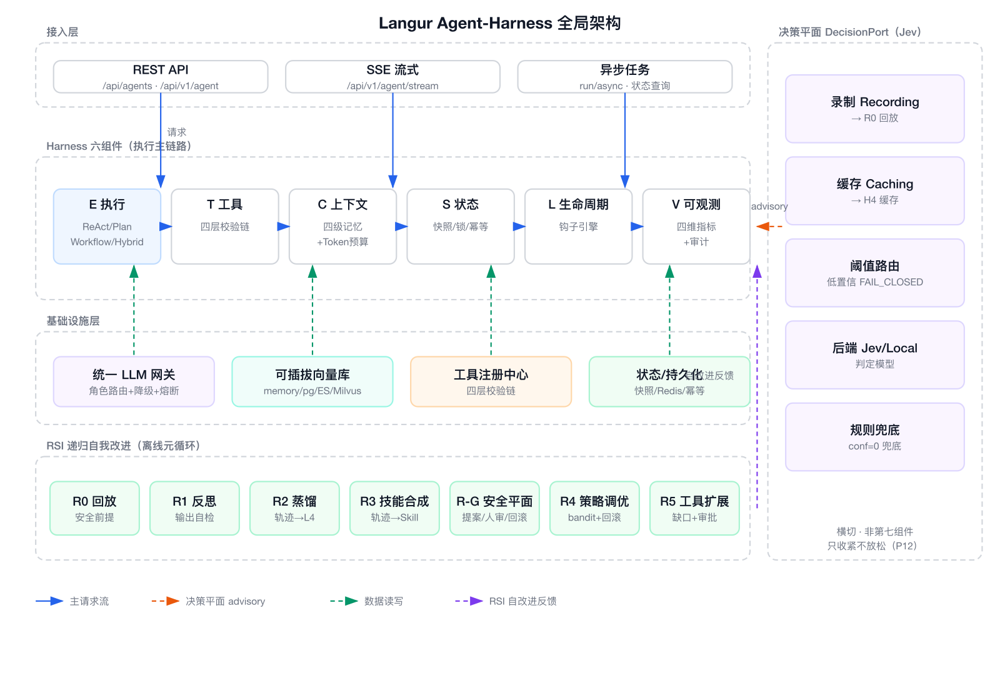
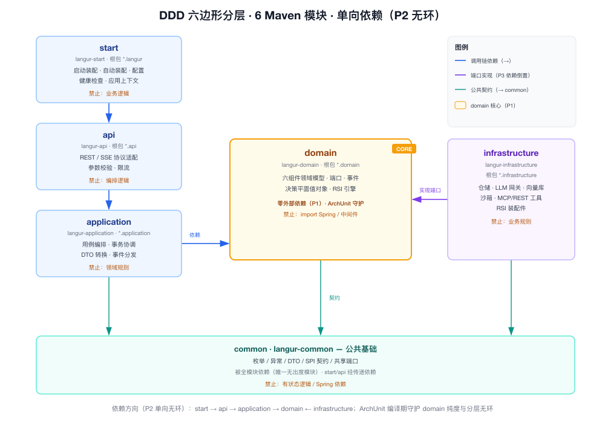
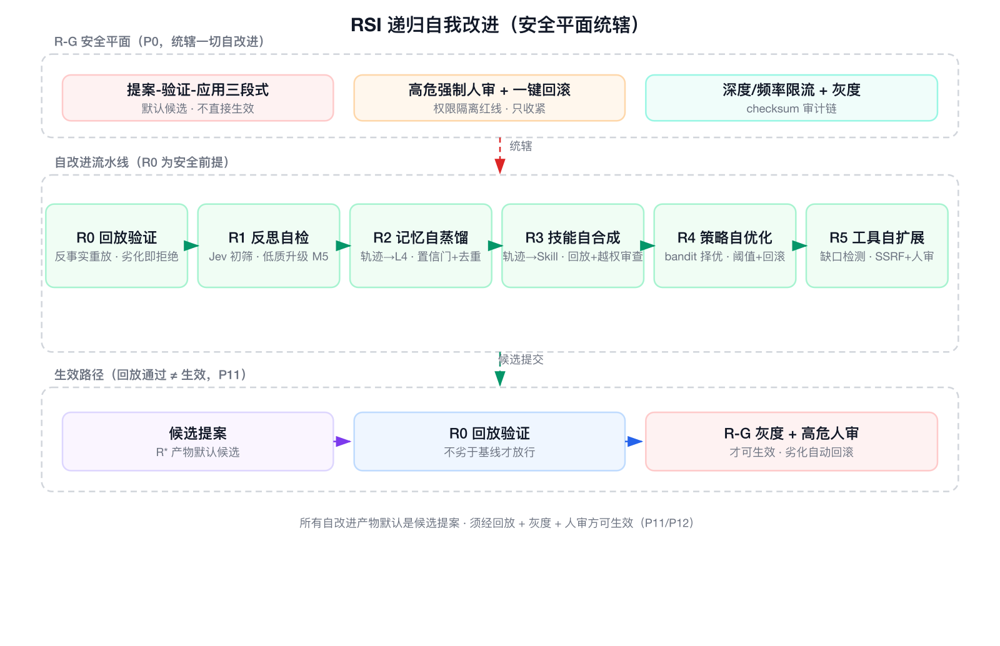

# Langur 架构设计 — Harness · Jev · RSI 三大架构哲学

> **文档性质**: 架构设计知识文档（Architecture Design & Knowledge Base）——Langur 企业级 Agent-Harness 框架的**完整构建哲学 + 可落地实践方法论**，可作为 AI Coding 的详细设计指引与知识沉淀
> **日期**: 2026-09-26 | **定位**: 开源共建，独立企业级 Agent-Harness 框架（Java 17 / Spring Boot 3.2 / DDD 六边形，6 Maven 模块，根包 `org.skylark.langur.*`）
> **核心公式**: `Agent = LLM生成能力(System-2) + 决策平面判定能力(System-1) + Harness确定性调度 + RSI可控自演进`
> **一句话立场**: **大模型写，决策平面判，Harness 管，RSI 进化。**
> **三大架构哲学**: ① **Harness**（确定性调度底座）② **Jev**（判定式决策平面，判定/生成分离）③ **RSI**（递归自我演进，自我改进 ≠ 自我失控）

---

## 一、背景与目标

### 1.1 大模型生产落地六大缺陷

大模型原生落地生产环境，存在六大致命缺陷。Harness 以六个控制单元逐一对应解决：

| # | 生产缺陷 | 风险表现 | Harness 组件 | 解决策略 |
|---|----------|----------|--------------|----------|
| 1 | 无流程强制管控 | 模型自由发挥、流程不可控 | **E** 执行循环器 | 三大 Runtime 范式 + 终止闸门 |
| 2 | 无工具安全风控 | 越权调用、注入攻击、资损 | **T** 工具注册中心 | 九元组注册 + 四层校验链 |
| 3 | 无结构化记忆治理 | 上下文污染、Token 失控、幻觉 | **C** 上下文管理器 | 四级分层记忆 + 双画像 |
| 4 | 无状态持久化容灾 | 崩溃丢失、无法续跑 | **S** 状态存储库 | 快照 + 断点续跑 + 回滚 |
| 5 | 无全链路安全拦截 | 敏感泄露、合规缺失 | **L** 生命周期钩子 | 12 拦截点 + 四层纵深防御 |
| 6 | 无可观测合规审计 | 黑盒运行、无法溯源 | **V** 评估观测接口 | 五维指标 + Trace + 审计 |

> **问题域的共性**：大模型的输出是**概率性的**，而生产环境的约束是**确定性的**（权限、预算、合规、可回滚）。二者之间缺的不是"更强的模型"，而是一层**确定性的调度底座**——这就是 Harness 的存在意义。

### 1.2 三大架构哲学总览

Langur 的完整理念由**三条哲学**构成，它们分层正交、互相咬合，共同回答"Agent 系统如何安全、可控、可进化地走向生产"：

| 哲学 | 一句话内核 | 回答的问题 | 对应能力面 | 成熟度 |
|------|-----------|-----------|-----------|--------|
| **Harness** | 确定性调度底座——**模型负责写，Harness 负责管** | 概率性模型输出如何被确定性约束（权限/预算/合规/可回滚）？ | 六组件 E/T/C/S/L/V + DDD 六边形 + 五层防御 | G1/G2/G3 ✅ |
| **Jev** | 判定式决策平面——**大模型写，决策平面判**（判定/生成分离，P12） | 路由/闸门/评分/分类等"判定"如何**快、廉、校准、可批量**？ | `DecisionPort`（System-1，首个后端 Jev） | D0→D3 ✅ |
| **RSI** | 递归自我演进——**自我改进 ≠ 自我失控**（P11） | Agent 系统如何用**自身运行数据**持续改进自身且不失控？ | RSI 元循环 R0–R5/R-G | L1–L5 ✅ |

**三条哲学的三角关系**：

- **Harness 是底座**：既是 RSI 的**使能器**（提供感知与执行器官），也是 RSI 的**约束器**（提供安全平面）。Jev 与 RSI 都运行在 Harness 的确定性调度与五层防御之上。
- **Jev 是运行期判定底座**：决策平面像 `LLMPort`/`RerankPort` 一样是被消费的**端口**（非第七组件，P4 正交不破），是 RSI 的**运行期底座**。
- **RSI 是离线优化器**：消费决策平面，经回放 + 灰度 + 审批优化其阈值/prompt/路由，是决策平面的**离线优化器**。

> **一句话贯穿**：Harness 让 Agent **安全可控地跑起来**；Jev 让系统**用判定的方式决定怎么跑**（省模型、更确定）；RSI 让系统**用自身数据越跑越强**——三者的终极闭环是"模型写、决策判、Harness 管、RSI 进化"。

---

## 二、全局架构

### 2.1 全局架构图



### 2.2 DDD 六边形分层（6 Maven 模块）



框架采用六边形 DDD 架构，划分为六个独立 Maven Artifact，每个模块拥有独立根包（`org.skylark.langur.*`），通过包路径实现编译期依赖隔离：

| 模块 | Artifact | 根包 | 核心职责 | 禁止事项 |
|------|----------|------|----------|----------|
| **common** | langur-common | `*.common` | 枚举/异常/DTO/SPI 接口/共享端口 | 禁止有状态逻辑、禁止 Spring 依赖 |
| **domain** | langur-domain | `*.domain` | 六组件领域模型/服务/端口/事件 | 禁止依赖任何外层模块及中间件 |
| **application** | langur-application | `*.application` | 用例编排/事务协调/DTO 转换/事件分发 | 禁止包含领域规则 |
| **infrastructure** | langur-infrastructure | `*.infrastructure` | 仓储实现/LLM 适配/中间件/沙箱 | 禁止包含业务规则 |
| **api** | langur-api | `*.api` | REST/SSE 协议适配/参数校验/限流 | 禁止包含编排逻辑 |
| **start** | langur-start | `*.langur` | 启动/自动装配/配置/健康检查 | 禁止包含业务逻辑 |

依赖方向（强制单向）：

```
start → api → application → domain ← infrastructure
                              ↑
                        common (全模块依赖)
```

**依赖治理（已落地 ArchUnit）**：`ArchitectureGuardTest` 编译期守护三条不变量——① domain 纯度（零 Spring / 零 infrastructure import）；② common 无状态 Bean（无 `@Component/@Service/@Repository`）；③ 六模块依赖无环。domain 层仅允许依赖 common + lombok，零外部依赖（P1）。

### 2.3 Harness 六组件 + 决策平面横切


```
                ┌─────────────────────────────────────────────┐
                │  决策平面（DecisionPort，System-1 判定层）      │
                │  Jev 后端 + 录制/缓存/阈值/数据驻留装饰链        │
                └─────────────────────────────────────────────┘
                                   ▲ ObjectProvider 横切注入（非第七组件）
┌──────┐   ┌──────┐   ┌──────┐   ┌──────┐   ┌──────┐   ┌──────┐
│  E   │ → │  T   │ → │  C   │ → │  S   │ → │  L   │ → │  V   │
│执行  │   │工具  │   │上下文│   │状态  │   │生命周期│  │可观测│
└──────┘   └──────┘   └──────┘   └──────┘   └──────┘   └──────┘
```

| 组件 | 全称 | 聚合根/核心服务 | 核心能力 |
|------|------|-----------------|----------|
| **E** | Execution Loop 执行循环器 | `ExecutionTask` / `ExecutionLoopService` | 四大范式运行、终止闸门、循环检测、容错降级 |
| **T** | Tool Registry 工具注册中心 | `ToolDefinitionEntity` | 九元组注册、四层校验链、统一路由调度 |
| **C** | Context Manager 上下文管理器 | `AgentContext` | 四级记忆、双画像、Token 治理、脱敏过滤 |
| **S** | State Store 状态存储库 | `TaskState` | 快照、断点续跑、事务回滚、分布式锁 |
| **L** | Lifecycle Hooks 生命周期钩子 | `LifecycleHookEngine` | 12 拦截点、四层防御、Hook 链中断/放行 |
| **V** | Evaluation Interface 评估观测 | `EvaluationService` | 五维指标、全链路 Trace、不可篡改审计 |

六组件协同闭环（标准执行时序）：

```
环境状态采集
→ [C] 上下文加载(记忆+画像+脱敏过滤)
→ [E] 执行循环驱动模型推理决策
→ [T] 工具中心(权限校验+Schema校验+沙箱执行)
→ [S] 状态存储写入本轮执行快照与结果
→ [L] 生命周期钩子全节点安全拦截与合规植入
→ [V] 观测接口全量轨迹/指标/日志留存
→ [E] 判断任务终止条件 → 结束迭代 或 进入下一轮
```

> **决策平面横切不破 P4**：决策平面像 `LLMPort`/`RerankPort` 一样，是被 E/T/C/L/V **消费的端口**，经 `ObjectProvider<DecisionPort>` 松耦合注入；缺失即降级（P10）。它是**横切端口**，不占六组件正交位（详见第四章）。

### 2.4 三层混合 Runtime

| 层级 | 范式 | 职责 | 控制权 | 适用场景 |
|------|------|------|--------|----------|
| 顶层 | Workflow | 锁定合规边界/审批/强约束 | Harness 全权 | 强合规流程、审批工单 |
| 中层 | PlanAndExecute | 全局任务拆解/进度管控/动态调优 | LLM 规划 + Harness 校验 | 复杂长链路任务 |
| 底层 | ReAct | 细粒度工具推理/局部动态交互 | LLM 自主 + Harness 兜底 | RAG/开放对话 |
| 混合 | Hybrid | Workflow 锁边界 → Plan 拆解 → ReAct 执行 | 三层分权 | 全场景最优适配 |

```
任务进入 → LayerRouter 判断:
  ├── 强合规/审批类 → 顶层 Workflow
  ├── 多步骤复杂任务 → 中层 PlanAndExecute
  ├── 单轮推理/开放问答 → 底层 ReAct
  └── 默认(未指定) → ReAct
```

### 2.5 五层纵深防御

```
Layer 1: 接入安全 — 身份鉴权/JWT/限流/黑名单/IP白名单
Layer 2: 输入安全 — 敏感词检测/Prompt注入拦截/长度校验
Layer 3: 执行安全 — 工具沙箱/权限校验/高危审批/越权阻断
Layer 4: 输出安全 — 内容审核/资损校验/涉密过滤/合规检测
Layer 5: 审计安全 — 全量留痕/不可篡改/合规归档/溯源查询
```

### 2.6 全链路执行时序

```
═══ 启动阶段(应用初始化时) ═══
[Start] → McpClientManager.init() → 连接MCP Server → tools/list发现 → 注册到[T]
        → SkillRegistrar.register() → 扫描@SkillDef注解 → 注册所有Skill
        → RestApiToolRegistrar.register() → OpenAPI解析/手动配置 → 注册到[T]

═══ 请求处理阶段 ═══
Client → [API] GovernanceFilter(鉴权/限流/参数校验/TraceId生成)
       → [APP] AgentApplicationService.dispatch() → LayerRouter.route() → 范式分发
       → [L] BEFORE_CONTEXT_ASSEMBLE Hook
       → [C] 上下文组装(并行: 画像+记忆+知识+工具列表+Skill列表)
       → [C] 脱敏过滤 + Token治理
       → [L] AFTER_CONTEXT_ASSEMBLE Hook
       → [S] 断点恢复检测(是否有未完成快照)
       → [E] 执行循环启动
           ┌─→ [L] BEFORE_INFERENCE Hook
           │   [E] LLM推理(通过LlmGateway, tools含全部来源工具)
           │   [L] AFTER_INFERENCE Hook
           │   [E] 解析LLM返回的tool_calls → [T]统一路由执行
           │   [L] BEFORE/AFTER_TOOL_CALL Hook
           │   [S] 本轮快照写入
           │   [E] 终止判断(闸门检测)
           └── 未终止 → 下一轮 / 已终止 → 退出循环
       → [V] 指标上报 + Trace结束
       → [L] BEFORE_OUTPUT Hook(输出合规)
       → [API] 响应返回
```

---

## 三、哲学一 · Harness —— 确定性调度底座（模型负责写，Harness 负责管）

### 3.1 哲学内核

**大模型是概率性的，生产环境是确定性的。** Harness 的哲学内核是：**不追求"更强的模型"，而是用一层确定性调度底座，把概率性输出约束到确定性边界内**（权限、预算、合规、可回滚）。模型只负责"写"（推理、生成），Harness 负责"管"（校验、调度、审计、安全）。

两条不可违背的隔离原则贯穿始终：**模型与环境隔离**（LLM 不直连外部资源，一切工具调用经 T 组件校验 + 沙箱执行）、**推理与治理隔离**（权限/合规/风控/审计下沉 Harness，无需改 Prompt）。

> 每节按 **职责 → 核心机制 → 落地状态 → 剩余缺口** 四段展开。

### 3.2 E — 执行循环器

**职责**：驱动"感知-推理-行动"循环，是 Agent 运行的核心引擎。

**核心机制**：

- **运行范式（四范式全落地）**：`ParadigmDispatchingExecutionLoop` 按 `RuntimeParadigm` 分发到 **ReAct** / **PlanAndExecute**（H3：规划拆解→逐步委派 ReAct 子循环→动态重规划）/ **Workflow**（H9：阶段固化+审批闸门）/ **Hybrid**（H9：Workflow 锁边界→Plan 拆解→ReAct 执行）；未注册范式降级 fallback 并记录。
- **终止闸门**：`TerminationGate` 四维硬约束全部生效——maxRounds / maxTokens（H1 后用真实 token usage）/ maxTimeout / maxCallsPerRound；闸门触发优先归因。
- **容错**：`RetryPolicy`(次数上限+退避) → 熔断 → `FallbackStrategy`(降级话术) → 终止。
- **循环检测**：`LoopDetector` 记录最近 N 轮 action/observation 指纹，重复超阈值触发 `LOOP_DETECTED` 终止。
- **断点续跑 + 分布式锁**：`LockingExecutionLoopService`（H4）外层按 taskId 获取分布式锁防并发重入 + `isResumable` 从最近快照恢复。

**落地状态**：T1/T2/T5/T7（校验接入、闸门、续跑、容错）+ H3/H9（PlanAndExecute/Workflow+Hybrid）+ H4（分布式锁）+ H1（真实 Token 计量）——✅ 95%。

**剩余缺口**：学习型层路由（属 RSI，§5.6）；判定式路由/完成度（决策平面，§4.5.2/§4.5.3）。

### 3.3 T — 工具注册中心

**职责**：统一注册、校验、调度所有来源的工具，是模型与环境的唯一通道。

**核心机制**：

- **九元组注册**：ID / 描述 / 入参 Schema / 出参 Schema / 权限 / 风险 / 白名单 / 限流 / 超时（缺一不可）。
- **四层校验链**（责任链模式）：`WhitelistToolValidator`(白名单准入) → `SchemaToolValidator`(参数/注入/格式强校验) → `PermissionToolValidator`(动态权限) → `SandboxToolValidator`(沙箱隔离执行)。
- **五源统一路由**（`DefaultToolDispatcher.dispatch` → `switch(source)`）：

| 来源 | toolSource | ID 规范 | 网关 |
|------|-----------|---------|------|
| 本地工具 | `LOCAL` | 工具名 | `ToolProvider`→`Tool` |
| SPI 工具 | `SPI` | 业务自定义 | `ToolProviderSPI`/`BizCodeRouter` |
| MCP 远程工具 | `MCP` | `mcp:{server}:{tool}` | `McpClientManager`（四传输 + 热更新 + 熔断，H6） |
| REST API 工具 | `REST_API` | `api:{service}:{operationId}` | `WebClientRestApiToolGateway`（OpenAPI 自动发现 + OAUTH2 + KMS，H7） |
| Skill 高阶能力 | `SKILL` | `skill:{name}` | `DefaultSkillToolGateway`（七步骤编排，H8） |

- **MCP 集成（H6）**：STDIO / SSE / WebSocket / HTTP JSON-RPC 四传输；启动连接+`tools/list` 发现注册 → 心跳保活+断线重连 → `tools/list_changed` 热更新 → 优雅停机；`ServerCircuitBreaker` 按服务端连续失败跳闸隔离，单 server 故障不影响全局。
- **REST API as Tool（H7）**：OpenAPI Spec 自动发现（推荐）/ YAML 手动配置 / 注解声明；凭证托管 `CredentialVault`（BEARER/API_KEY/BASIC/OAUTH2）；SSRF 防护（字节级 IP 段判定）+ 路径白名单 + Schema 强校验。
- **Skill 编排（H8）**：`@SkillDef` 注解声明；七步骤类型 TOOL_CALL / CONDITION / LLM_CALL / LOOP / PARALLEL / SUB_WORKFLOW / SUB_AGENT；`SkillExpressionResolver` 安全最小集（`${input.x}`/`${step.field}` + 六运算符，**不引入脚本引擎杜绝表达式注入**）；全局步数硬上限 `MAX_STEPS=1000` 防环/防嵌套失控。

**落地状态**：T10a/b/c + H6/H7/H8 全部落地——✅ 98%。

**剩余缺口**：工具定义持久化（`t_tool_definition`）写入链路未全接；rateLimitPerMinute 强制、出参 Schema 校验。

### 3.4 C — 上下文管理器

**职责**：结构化治理上下文，防止污染、Token 失控与幻觉。

**核心机制**：

- **四级记忆**：L1 瞬时（轮次销毁）→ L2 会话（摘要裁剪）→ L3 任务（快照绑定）→ L4 知识（向量检索）。
- **双画像**：`UserProfile`（权限/脱敏/偏好）+ `TaskProfile`（风险/工具链/Prompt 模板）。
- **装配与脱敏**：`DefaultContextAssembler` 在 BEFORE/AFTER_CONTEXT_ASSEMBLE 钩子间真实装配并写仓储；`KeywordMaskingContextSanitizer` 关键词脱敏（可插拔）。
- **语义向量（H2）**：`EmbeddingPort`/`VectorStore`/`RerankPort` 端口 + `LlmEmbeddingPort`（M2 走 provider `/embeddings`）+ `EmbeddingRerankPort`（M3 语义 cosine + 词面覆盖混合打分）；`VectorMemoryService` 提供 L4 cosine Top-K 召回 + Token 预算截断 + 可选重排去噪；失败降级本地同维哈希嵌入（P10）。
- **Token 治理**：预算分配制，防止上下文溢出。

**落地状态**：T3 + T14 + H2 落地——✅ 90%。

**剩余缺口**：L4 知识自动蒸馏（属 RSI，§5.4）；Embedding/Rerank 质量随 provider 模型能力。

### 3.5 S — 状态存储库

**职责**：快照、断点续跑、事务回滚、分布式锁，是容灾的根基。

**核心机制**：

- **快照/续跑/回滚**：`StateSnapshot` 每轮写入，`TaskState` 带 `@Version` 乐观锁；`JpaTaskStateRepository` 持久化重建（`langur.repository.type=jpa`）。
- **L2 热层 + 分布式锁（H4）**：`CacheBackend`（带 TTL 的 kv 读写 + 原子自增）+ `DistributedLock`（holder 可重入 + TTL 租约自动过期）；`RedisCacheBackend`/`RedisDistributedLock`（`langur.cache.type=redis`，SETNX+Lua 原子解锁）与 `MemoryCacheBackend`/`MemoryDistributedLock`（memory 默认/测试兜底），任一操作异常静默降级内存后端（P10）。
- **锁机制**：`LockingExecutionLoopService` 统一入口外层按 taskId 获取分布式锁，并发重入即终止、finally 释放（替代原 DB 行级锁语义）。

**落地状态**：T11 + H4 落地——✅ 90%。

**剩余缺口**：跨存储层一致性策略；Redis 生产运维（连接池/哨兵/集群）。

### 3.6 L — 生命周期钩子

**职责**：全流程非侵入安全拦截，是五层防御的执行载体。

**核心机制**：

- **12 拦截点**：BEFORE/AFTER × 6 阶段（Context/Inference/ToolCall/StateSave/Terminate/Output）。
- **四动作**：`HookAction` CONTINUE / ABORT / SKIP / MODIFY（OUTPUT 点支持 MODIFY 改写最终答案 + ABORT 阻断）。
- **安全钩子（H10）**：`PromptInjectionGuardHook`（BEFORE_INFERENCE，注入命中 ABORT）+ `ContentReviewOutputHook`（BEFORE_OUTPUT，涉密/资损/合规命中 ABORT），`langur.security.*.enabled` 配置驱动、自动汇入 `LifecycleHookEngine`。
- **高危审批流（H10）**：`CriticalApprovalValidator`（四层校验链 order=350）对 CRITICAL 工具无审批单则创建 PENDING 挂起（状态 SUSPENDED 可续跑）→ 批准从快照恢复 / 拒绝中断；审批后端缺失 fail-closed。

**落地状态**：T4 + H10 落地——✅ 92%。

**剩余缺口**：运行时动态启停、12 点↔四层防御显式映射校验。

### 3.7 V — 评估观测

**职责**：五维指标、全链路 Trace、不可篡改审计，是生产可观测的闭环。

**核心机制**：

- **五维指标**：`MetricDimension` 模型层/调度层/工具层/安全层/决策层；`ExecutionMetrics` 采集。
- **导出后端（H5）**：`MicrometerEvaluationService`（`evaluation=prometheus` 装配，暴露 `/actuator/prometheus`）+ `LoggingEvaluationService`（条件默认）。
- **告警分级（H5）**：`AlertEvaluator` 纯规则引擎 + `AlertRule`（6 规则）+ `AlertLevel`（P0 阻断 / P1 降级+OnCall / P2 终止 / P3 日报），阈值配置驱动，通道失败静默降级（P10）。
- **Trace**：`OtelExecutionTracer` 六类 Span（API/上下文/推理/工具/快照/输出），traceId 从 API 层透传。
- **审计**：`AuditRecord` + `Checksums.sha256` 不可篡改校验；`AuditSink` 归档抽象（默认 `LoggingAuditSink`，MQ/对象存储为挂载点）。

**落地状态**：T12 + H5 落地——✅ 90%。

**剩余缺口**：MQ 上报为挂载点（RocketMQ 未强依赖）；决策维度指标（§5.10）。

### 3.8 LLM 模型矩阵与统一网关（H13）

**职责**：按职责分工组织模型矩阵，并通过配置驱动的统一网关完成"一处适配、零代码扩厂"。

**模型矩阵（M1–M6）**：

| 角色 | 职责定位 | 落地状态 |
|------|----------|----------|
| **M1 ROUTING** | 轻量路由/意图识别 | 🟡 规则路由（学习型属 RSI，判定式属决策平面 §4） |
| **M2 EMBEDDING** | 文本向量化/记忆写入 | ✅ `LlmEmbeddingPort`（H2，失败降级本地同维哈希） |
| **M3 RERANK** | 检索去噪/重排序 | ✅ `EmbeddingRerankPort`（H2，cosine + 词面覆盖） |
| **M4 ACTION** | 工具调用/Function Call | ✅ 经 `LlmGateway` |
| **M5 REASONING** | 规划/自检/复杂推理 | ✅ `LlmPlanner`（H3 规划拆解） |
| **M6 LONG_CONTEXT** | 长文档/审计 | ✅ 配置就绪 |

**统一模型网关（H13，2026-09-26）**：

- **配置驱动的 Provider 类型工厂**：`ModelProviderFactory` 遍历 `langur.llm.providers.*` 中 `enabled=true` 的条目，按 `type`（`openai-compatible | anthropic | gemini`）实例化适配器模板，产出 `List<ModelRoutableLLMPort>` 供 `LLMRouter` 注入。**新增 OpenAI 兼容厂商 = 纯 YAML，零 Java 代码**（P5/P9）。
- **国内外主流全覆盖**：GPT / Claude / Gemini（国际）+ Qwen / GLM / DeepSeek（国内）；Moonshot、百川、讯飞、阶跃、MiniMax、零一万物等多为 openai-compatible → 零代码扩厂。
- **降级真正生效（H13.4）**：适配器传输/HTTP/解析失败抛 `ModelProviderException`（不再吞成 `"Error: ..."`），`LlmGateway.withFallback` 捕获 → 按 `fallback-chains` 逐级降级；链耗尽抛 `IllegalStateException`。
- **Provider 健康熔断（H13.7）**：`ProviderCircuitBreaker` 每 provider 独立——连续失败跳闸 → 快速跳到降级链下一个 → 冷却半开试探；暴露 `llm_provider_circuit_state` 指标。
- **计量与密钥一致**：`completeWithUsage` 回传 `CompletionResult{content, usage}`（H13.5）；`api-key-ref` 经 `SecretResolver`（`env:/prop:/kms:`）解析，**绝不落日志**，缺 KMS 后端 fail-closed（H13.6）。

**落地状态**：H13.1–H13.7 全部达成（G1 网关统一 + G3 弹性）。

### 3.9 存储分层与可插拔向量库（H14）

**职责**：四级存储分层平衡性能与持久化，L4 向量库可插拔 + 原生混合检索。

**四级存储分层**：

| 层级 | 介质 | 数据特征 | 用途 |
|------|------|----------|------|
| L1 | 内存 | 当前轮次热数据 | 执行循环中的瞬时状态 |
| L2 | Redis | 热状态（带 TTL） | 会话状态、分布式锁、限流计数 |
| L3 | MySQL | 持久归档 | 任务状态、快照、工具定义、审计日志（七表） |
| L4 | 向量库 | 静态可信知识 | 知识库语义检索、长期记忆存取 |

**可插拔向量库（H14，2026-09-26）**：

- **端口扩展**：`VectorStore` 增 default 方法 `delete/upsertAll/search(SearchQuery)/supportsHybrid()/hybridSearch()`——既有 `InMemoryVectorStore`/`PgVectorStore` **零改动即编译**（P5 开闭）。
- **四种实现**：`memory`（默认，行为不变）/ `pgvector`（数据源修复 + JDBC batch）/ `ElasticsearchVectorStore`（dense kNN + BM25）/ `MilvusVectorStore`（dense + sparse，BM25 function）。
- **原生混合检索（下推优先，应用侧兜底）**：ES/Milvus 打开 `supportsHybrid()=true` 走原生 hybridSearch；memory/pgvector 走 `search + EmbeddingRerankPort` 应用侧混合（现状路径）。融合算法默认 **RRF**（Reciprocal Rank Fusion，基于排名、免分数归一化）。
- **关键降级（DD20）**：ES `retriever.rrf` 属 Platinum+ 付费层 → 缺省 `native-rrf=false` 走"两查询 + 客户端 RRF 融合"；Milvus RESTful v2 无服务端 Ranker 下推 → 客户端融合。任何原生失败自动降级客户端融合（P10 不中断）。
- **维度一致性守卫（H14.8）**：启动校验 `langur.vector.dimension == EmbeddingPort.dimensions()`，不一致 **fail-fast**，杜绝硬编码 256 与 llm 1536 冲突导致的静默召回损坏。
- **安全**：ES/Milvus/pgvector `password-ref` 全经 `SecretResolver`；`uris/uri` 经 `SsrfGuard`；`SearchFilter` 必带 `namespace` 隔离，杜绝跨租户召回；store 不可用 **fail-fast + 健康降级，绝不静默转内存**（防数据丢失错觉）。

**落地状态**：H14.1–H14.8 全部达成（G2 向量库可插拔）。

### 3.10 安全合规五层防御

| 原则 | 说明 |
|------|------|
| 零信任 | 所有工具调用默认不可信，必须经四层校验 |
| 最小权限 | 基于用户画像动态授予最小工具集 |
| 纵深防御 | 五层拦截，单点突破不致全局失守 |
| 审计全覆盖 | 所有操作不可篡改留痕 |
| 资损零容忍 | 金额相关操作多层校验 + 阻断机制 |

- **输入安全（H10）**：`PromptInjectionDetector` 中英文注入话术四类正则检测（指令覆盖/角色劫持/护栏绕过/系统提示词泄露）。
- **执行安全**：四层校验链 + `runGeneric` 沙箱（守护线程池 + `future.get(timeout)` 硬超时熔断）。
- **输出安全（H10）**：`OutputContentReviewer` 涉密/资损/合规三类审核。
- **审计安全**：checksum 不可篡改 + `AuditSink` 归档。

### 3.11 设计原则（P1–P11）

| # | 原则 | 约束力 | 落地 |
|---|------|--------|------|
| P1 | 领域核心不可侵犯（Domain 零外部依赖） | 强制 | ✅ ArchUnit 守护 |
| P2 | 严格单向依赖 | 强制 | ✅ |
| P3 | 依赖倒置 | 强制 | ✅ |
| P4 | 六组件正交 | 强制 | ✅ |
| P5 | SPI 开闭原则 | 强制 | ✅ |
| P6 | 安全纵深防御 | 强制 | ✅（H10 补输入/输出/审批） |
| P7 | 可观测优先（无观测=未上线） | 强制 | ✅（H5 补 Prometheus + 告警 + 归档） |
| P8 | 渐进式演进 | 推荐 | ✅ |
| P9 | 配置化驱动 | 推荐 | ✅（H13/H14 全程配置驱动） |
| P10 | 降级兜底（外部依赖失败主链路不中断） | 强制 | ✅ |
| P11 | 自演进可控（RSI 产物默认候选，回放+灰度+审批方可生效） | 强制 | 见第五章 |

> **P12（判定/生成分离 + 判定可回放可降级 + 对安全闸门恒 advisory）** 为决策平面的专属红线，见 §4.6。

---

## 四、哲学二 · Jev —— 判定式决策平面（大模型写，决策平面判）

### 4.1 哲学内核：双系统决策模型

哲学二的真正内核是**判定/生成分离**（P12）：**"写"和"判"是两种不同性质的计算，应该交给两种不同的模型。** 生成式 LLM（System-2）擅长"写"（草稿/改写/规划/工具参数），但**慢、贵、输出不确定**；判定式决策模型（System-1，首个后端 = TypeSafe **Jev**）擅长"判"（路由/闸门/评分/分类/完成度），**快（~33ms–百毫秒级）、廉（输入 $0.042/M、输出免费）、校准带置信度、可批量**。

**现状痛点**：Harness 落地后，系统里所有"判定"动作都落在三类不理想的实现上：

| 判定点 | 现状实现 | 问题 |
|--------|----------|------|
| 层/范式路由（`DefaultLayerRouter`） | bizCode 查表 + 字符串标记 + 规划特征 | **脆弱**：依赖命名约定，语义模糊任务误判 |
| 输出合规审核（`OutputContentReviewer`） | 关键词/正则 | **召回有限**：换个说法就漏；无语义理解 |
| Skill 条件（`SkillExpressionResolver` CONDITION） | 安全最小集表达式 | **只能判结构化字段**，无法判"这段 PRD 是否完整" |
| 审批触发（`CriticalApprovalValidator`） | CRITICAL 风险一律挂起人审 | **一刀切**：低风险也排队，长任务吞吐受限 |
| 完成/卡死判定（`TerminationGate`/`LoopDetector`） | 四维硬约束 + 指纹去重 | **只会数轮次/比指纹**，不懂"任务是否真的达成" |
| 反思自检（R1 规划） | 计划用 M5(REASONING) self-critique | **贵**：每次判定都烧一次大模型推理 |

**共性**：这些都需要一个**快、便宜、校准、可批量**的"判定器"，而不是生成器。决策平面（Jev）正是为此而生——它**不生成 token，只返回类型化判定 + 置信度**。

**双系统决策模型（Kahneman 映射到 Harness）**：

```
                        ┌──────────────────────────────────────────────┐
   任务/上下文 ───────▶ │  System-1  决策平面（Jev / DecisionPort）      │  快·廉·校准·可批量
                        │  判定：路由 / 闸门 / 评分 / 分类 / 完成度        │  输出：choice|noul|score + confidence
                        └───────────────┬──────────────────────────────┘
                                        │ 高置信 → 程序化分流（run/skip/branch/approve/terminate）
                                        │ 低置信 → fail-closed（升级 / 人审 / 回退规则）
                                        ▼
                        ┌──────────────────────────────────────────────┐
                        │  System-2  生成式 LLM（M4/M5/M6 + LlmGateway） │  慢·贵·强表达
                        │  生成：草稿 / 改写 / 规划文本 / 工具调用参数     │  输出：自然语言 / 结构化生成
                        └──────────────────────────────────────────────┘

   原则：能用 System-1 判定的，绝不烧 System-2；System-2 产出的文本，再由 System-1 验收。
```

**设计目标（四诉求 + 一条铁律）**：

| 诉求 | 含义 | 度量 |
|------|------|------|
| **快** | 判定远快于生成 | `decision_latency` ~33ms–百毫秒级，≪ 生成延迟 |
| **廉** | 不烧大模型推理 | 输入 $0.042/M、**输出免费**（Jev）；近零边际成本（自部署） |
| **校准** | 输出带置信度 | `confidence` + `distribution` 可标定、可调优、可回放 |
| **可批量** | 多问题一次请求 | "speculative fan-out"：state 只发一次 |
| **铁律（P12）** | 判定/生成分离，对安全闸门恒 advisory | 只收紧不放松、低置信 fail-closed |

**成熟度演进（D0 → D3，均已达成）**：

| 级别 | 能力 | 说明 | 任务 |
|------|------|------|------|
| **D0** | 规则判定（现状） | 正则/字符串/固定规则 + 昂贵 M5 判定 | — |
| **D1** | Jev advisory | `DecisionPort` 接入，仅非安全闸门做**建议** + 规则兜底，默认关、可录制 | J1–J3 |
| **D2** | Jev 闸门生效 | Workflow 决策闸门 / 审批分级(非CRITICAL) / 产物验收 / 执行器择优 上线，批量+缓存+录制 | J4–J10 |
| **D3** | RSI 调优 Jev | R4 经回放+灰度自动调阈值/prompt/路由（`DecisionEngineSPI` 热插拔） | R0 R-G R4 |

> **D2→D3 的跃迁 = 决策平面从"人工标定的判定器"进化为"自我优化的判定器"**，这正是 Jev 与 RSI 整合的终局价值。

### 4.2 决策平面契约 DecisionPort（J1）✅

新增 domain 端口 `DecisionPort`，与 `LLMPort`/`RerankPort` 同构；值对象纯 JDK：

```
DecisionPort
  DecisionResponse decide(DecisionRequest request)          // 单请求可含多问题（批量/投机扇出）

DecisionRequest   { String state;                           // 原始上下文（串/JSON）
                    String model;                           // 后端模型标识（可空→用配置默认）
                    List<DecisionQuestion> questions; }     // 一次多问，state 只发一次

DecisionQuestion  { String key;                             // 答案映射键
                    DecisionType type;                      // CHOICE | PROBABILITY | SCORE
                    String instructions;                    // 判定指令（显式自然语言）
                    Map<String,String> criteria; }          // CHOICE 的候选枚举（可选）

DecisionType      { CHOICE, PROBABILITY, SCORE }            // 对齐 Jev: choice / noul / score

DecisionResponse  { Map<String,DecisionAnswer> answers;
                    TokenUsage usage; }                     // 复用 H1 TokenUsage 计量

DecisionAnswer    { DecisionType type;
                    String  choice;                         // CHOICE：选中枚举
                    double  value;                          // PROBABILITY：0..1；SCORE：分档连续值
                    double  confidence;                     // 置信度（阈值分流依据）
                    Map<String,Double> distribution; }      // CHOICE 完整分布（可观测/调优用）
```

> **落地说明（J1，2026-09-25）**：`port/DecisionPort` + `harness/decision/{DecisionRequest, DecisionQuestion, DecisionType(CHOICE→choice / PROBABILITY→noul / SCORE→score), DecisionResponse, DecisionAnswer, DecisionThresholds(DD11 缺省 0.75/0.90/0.80/0.85)}` 均为纯 JDK record/enum（已断言无 Spring/Jackson import）；`DecisionResponse.usage` 复用 H1 `LLMPort.TokenUsage`。infra `TypeSafeDecisionAdapter`（WebClient REST、批量投机扇出 state 只发一次、后端异常/超时委派兜底不抛出）+ `RuleFallbackDecisionAdapter`（复用 H10 `OutputContentReviewer`，confidence 恒 0 → fail-closed）已落地；适配器不带 `@Component`，由 §4.4 `DecisionConfiguration` 条件装配。17 测全绿（domain 7 + infra 10，HttpServer 离线桩）。

> **后端无关**：契约只描述"类型化判定 + 置信度"，不绑定 Jev。托管 Jev、自部署 Kev/Laya、乃至规则兜底，都是 `DecisionPort` 的不同实现（P3 依赖倒置 / P5 开闭）。

### 4.3 首个后端：Jev（TypeSafe System One）

| 维度 | 托管 API（官方） | 自部署（社区平替，官方权重闭源） |
|------|------------------|----------------------------------|
| 端点 | `POST https://api.typesafe.ai/v1/systemone` | 本地端点（如 `openjev-sglang` / Kev 本地服务） |
| 鉴权 | `TYPESAFE_API_KEY`（`console.typesafe.ai` 生成） | 无/本地 |
| 模型 | `jev-latest`，生产**锁版本**（如 `jev-1.13.0`） | **Kev** 0.8B/4B/9B、**Laya** 421M（ModernBERT 编码器，~33ms）、**Nimble** 9B |
| 价格 | 输入 $0.042/M，**输出免费** | 自建算力，近零边际成本 |
| 请求/响应 | `{state, model, questions{noul\|choice\|score, instructions, criteria}}` → `answers{value/distribution, confidence, usage}` | Kev 号称**兼容 TypeSafe SDK**——仅换 base-url |
| SDK | **仅官方 Python**（无 Java/Spring） | 多为 Python/自有服务 |
| 批量 | "speculative fan-out"：多问题一次请求、state 只发一次 | 视实现 |

> **对 Java 栈的结论**：无官方 Java SDK，但它是**纯 REST/JSON**——用既有 `WebClient`（H6 SSE / H7 OAuth2 已在用）直接 POST 即可；API key 经 H7 `CompositeSecretResolver`/KMS 解析，**绝不明文**。另有 Jev MCP server，可经 H6 MCP 工具源零代码接入（但 MCP 给对话式语义，不如 REST 适配器贴合 `DecisionPort`）。

### 4.4 装饰器链（J2/J3）✅

| 装饰器 | 职责 | 对应原则/RSI |
|--------|------|--------------|
| `RecordingDecisionPort` ✅（J2） | 把每次 `decide` 的 request/response **录制进轨迹快照**（与 LLM 录制同通道，复用 S 组件 `StateSnapshot` + `DecisionTrajectoryRecorder`）；并经 H5 上报决策维度指标 + 审计 checksum | **R0 回放确定性（DD5 扩展）**——否则反事实重放失真 |
| `ThresholdRouter` ✅（J3） | `confidence ≥ 阈值` → 程序化分流；`< 阈值` → fail-closed（升级/人审/回退规则）；每次分流发 `decision_route_counts` | P10 降级 + P12 advisory |
| `CachingDecisionPort` ✅（J3） | 按 `state` 哈希 + 问题签名缓存判定（复用 H4 `CacheBackend`，键 `langur:decision:<sha256>`） | 效率（多闸门不重复调用） |
| `DataResidencyDecisionPort` ✅（J3） | 后端选择器（DD10/P12⑤）——命中 `sensitive-namespaces` 的 `state` 强制走 `LocalDecisionAdapter`；无 local 端点则 fail-closed 规则兜底，绝不发往第三方托管 | 数据驻留 |

```
DecisionPort（注入到 E/T/C/L 各处，均 ObjectProvider 可选）
  = RecordingDecisionPort            // 录制进快照（R0 前向兼容）
    └ CachingDecisionPort            // H4 CacheBackend 按 state 哈希缓存
      └ ThresholdRouter              // 置信阈值分流 + fail-closed
        └ TypeSafeDecisionAdapter    // langur.decision.backend=typesafe（托管 Jev）
        | LocalDecisionAdapter       // =local（自部署 Kev/Laya，敏感数据）
        | RuleFallbackDecisionAdapter// =off/不可用 → 回退现有规则/正则（P10）
```

> **落地说明（J3，2026-09-26）**：`DecisionConfiguration`（start，`@ConditionalOnProperty langur.decision.enabled=true`，默认关不产 Bean、行为与 Harness 基线一致）按上图组装；`decisionPort` 标 `@Primary`（`ThresholdRouter` 亦暴露为 Bean 供 J4–J10 注入 `route()`），消除双 `DecisionPort` Bean 歧义。backend=typesafe 且配置了 `sensitive-namespaces` 时，最内层再包 `DataResidencyDecisionPort`（DD10）。J2/J3 共 26 测全绿，默认关/开启双冒烟 UP。

### 4.5 十插入点（J4–J10）

> 总原则：**决策平面只改"判定"，不改"生成"**；所有插入点都带**规则/LLM 兜底**与**置信阈值**，默认关闭、灰度开启（P9/P10）。

#### 4.5.1 Workflow 模式 ✅ J4–J6

现状：Workflow 是**固定阶段序列**，只有 `requiresApproval` 闸门，阶段间无条件分支。决策平面补三处：

| 插入点 | 机制 | 类型 | 收益 | 红线 |
|--------|------|------|------|------|
| **① 阶段决策闸门** | `WorkflowStage` 增可选 `decisionGate`（一个 `DecisionQuestion` + 阈值 + 路由动作：run-next / skip / branch-to-stage / abort / require-approval）。阶段产出后由决策平面判定走向 | `choice`/`noul` | **跳过不必要的昂贵 LLM 阶段**（提效）；确定性（结果是带置信度、被记录的判定，非 LLM 自由发挥） | 低置信 → 走默认顺序（兜底） |
| **② 审批风险分级** | 对**非 CRITICAL** 审批闸门，用 `score` 风险三分流：低风险→策略内自动放行快路；中→人审；高/低置信→人审或中断 | `score` | 长任务（合同审查特批项）**吞吐提升** | ⚠️ **CRITICAL 恒人审**：Jev 只产出"风险摘要 + 建议"加速人工，**绝不自动放行**（只能收紧不能放松，P11/P12/R-G） |
| **③ 产物验收闸门** | `task.addArtifact(...)` 前用 `score` 判完整/合规，低于阈值→有界重试该阶段或打标 | `score` | 多产物（审查报告/特批项/PRD）**质量提升**（提准） | 重试受步数/Token 闸门约束 |

> **落地说明（J4–J6，2026-09-26）**：domain 新增 `StageDecisionGate`（闸门定义，配置驱动 P9：`langur.workflow.definitions[].stages[].decision-gate.{key,type,instructions,criteria,threshold,branch-to}`，经 `WorkflowDefinitionRegistrar` 装载）与 `GateRoute.of(answer, threshold)`（domain 侧分流，P2：不依赖 infra `ThresholdRouter`，语义对齐）；`WorkflowExecutionLoop` 织入可选 `DecisionPort`（start `HarnessConfiguration.attachDecisionPlane`，缺省不织入=行为与 Harness 基线一致）。①：skip 跳过下一阶段并计入 completed（恢复续跑确定性）、branch 带防环预算跳转、abort 中断、require-approval 建 `workflow-gate:<stageId>` 人审单挂起（恢复时 DENIED/PENDING 不得越过，只收紧）；低置信/异常/缺失 → 默认顺序（P12③）。②：`WorkflowStage.critical` 标记（配置 `critical: true`），CRITICAL 恒人审且**决策平面不被调用**；非 CRITICAL 安全分与置信均 ≥ approval-auto(0.90) → 自动放行并留 APPROVED 审批单（decisionBy=decision-plane 可溯源）。③：`Artifact` 增 `accepted/reviewNote`，低于 artifact-accept(0.80) → 至多 1 次有界重试（受终止闸门约束）→ 仍不达标打标不阻断。三处分流均发 `decision_route_counts`。14 测全绿（domain `WorkflowExecutionLoopDecisionGateTest` 12 + infra registrar 2）。

#### 4.5.2 Hybrid 模式 ✅ J7–J8

| 插入点 | 机制 | 类型 | 收益 |
|--------|------|------|------|
| **④ 每阶段执行器择优** | hybrid 中每个 Workflow 阶段委派 Plan 或 ReAct；用 `choice` 选"够用的最便宜执行器"——简单抽取→ReAct，复杂多步→Plan | `choice` | 提效（不为简单阶段烧规划） |
| **⑤ 升级/降级触发** | ReAct 阶段用 `noul`("是否已完成/是否在重复") 做廉价完成判定与卡死检测，接 `TerminationGate`/`LoopDetector`；该升 Plan 就升、该终止就终止 | `noul` | 提效 + 提准（接既有 replan-on-failure） |
| **⑥ 层路由（advisory）** | `DefaultLayerRouter` 增可选 `DecisionPort`：`choice` 选 paradigm，**低置信回退现有规则** | `choice` | 路由更准 ⚠️ **与 R4 学习型路由重叠（RSI）——本阶段仅 advisory、非自主自改进**；自动调优留待 R4 |

> **落地说明（J7–J8，2026-09-26）**：④⑤ 落在 `WorkflowExecutionLoop.executeStage`——HYBRID 范式 + 决策平面在场时，④ 经 `choice("stage-executor")`（阈值 `routing` 0.75）从 `attachStageExecutors` 注入的执行器池 {REACT, PLAN_AND_EXECUTE} 中择优，低置信/缺失/非 HYBRID 回退构造期 `stageParadigm`（Harness 基线固定中层 Plan，P10）；⑤ 仅在走了廉价 ReAct 路径时经**一次批量** `noul("stage-complete"/"stage-stuck")`（值+置信均 ≥ `completion` 0.85 才采信，阶段边界即检查点）判：已达成且阶段成功→提前成功终止跳过剩余阶段、重复卡死→升级 ReAct→Plan 重跑（无升级路径则终止）、低置信→PROCEED 回退既有 `LoopDetector`/`TerminationGate`（P12③）。⑥ 落在 `DefaultLayerRouter.route`——先规则后 advisory，`attachDecisionPlane(DecisionPort,阈值)` 经 DecisionPort 接缝注入（后端由 J3 装配、适配 `DecisionEngineSPI`/Jev，**不硬编进路由类**，C1）；高置信 `choice("layer-route")` 覆盖规则，低置信/不可识别/异常回退规则。**合规守卫**：规则判 WORKFLOW/HYBRID 时 advisory 绝不降级到无审批的 REACT/PLAN（P12②只收紧）；**advisory 无状态、不自修改路由规则**。14 测全绿（domain `WorkflowExecutionLoopHybridTest` 6 + `DefaultLayerRouterDecisionTest` 8）+ 双冒烟 UP。

#### 4.5.3 ReAct 模式 ✅ J9

| 插入点 | 机制 | 红线 |
|--------|------|------|
| **⑦ 完成判定** | `noul`("给定轨迹，任务是否已达成") 作为 `TerminationGate` 的**附加信号**（不替代四维硬约束） | 网络判定**只在检查点**调用（如每 N 轮），避免每轮往返反噬延迟 |
| **⑧ 卡死检测** | `choice`("是否在重复同一无效动作") 补 `LoopDetector` 指纹去重之外的语义判定 | 低置信 → 以既有指纹检测为准 |

> **落地说明（J9，2026-09-26）**：⑦⑧ 落在 `ReActExecutionLoop` 主循环——`LoopDetector` 指纹判定之后、快照写入之前插入**检查点语义判定**：`isDecisionCheckpoint(round)` 仅当 `round % N == 0`（缺省 N=3，配置 `langur.decision.react-checkpoint-rounds`）才发起**单次批量** `decide`（`task-complete` noul + `trajectory-stuck` choice，红线：绝不逐轮往返）。⑦ 值+置信均 ≥ `completion`（0.85）→ 合成最终答案提前**成功**终止（`react_early_complete`，**附加信号，不替代四维硬约束**）；⑧ choice 高置信判 `stuck` → `LOOP_DETECTED`（`react_stuck`）；低置信/缺失/异常 → PROCEED（`react_proceed`）回退既有指纹 + 闸门（P10/P12③）。`attachDecisionPlane(DecisionPort,阈值,检查点间隔)` 经 DecisionPort 接缝注入（P2 不破），`HarnessConfiguration.reActExecutionLoop` 以 `ObjectProvider` 织入；决策平面缺失（缺省 enabled=false）→ 不织入、行为同 Harness 基线（P12①）。domain 4 测全绿（`ReActExecutionLoopDecisionTest`，无 Mockito）+ 双冒烟 UP。

#### 4.5.4 Skill 子系统 ✅ J10

| 插入点 | 机制 |
|--------|------|
| **⑨ DECISION 步骤** | 新增 `StepType.DECISION`：由 `DecisionPort` 求值的**语义条件**（"这段代码上下文是否足以转译 PRD？"），补 `SkillExpressionResolver` 只能判结构化字段的短板；与既有 `CONDITION`（确定性表达式）并存，各取所长 |
| **⑩ 转译 PRD 质量门** | `TranslatePrdSkill` 的 `draft` 步骤后加 DECISION 验收（`score` 完整性），低分触发有界重draft |

> **落地说明（J10，2026-09-26）**：⑨ `StepType` 增 `DECISION`，`SkillStep` 增 `decisionKey/decisionType(score\|noul)/decisionInstructions/decisionThreshold`（复用 `arguments` 承载被判定材料、`onTrue/onFalse` 承载分支）+ 工厂 `decisionScore/decisionNoul`；`SkillExecutor` 把 DECISION 与 CONDITION 同列**分支步**（`nextIndexOf` 统一解析跳转目标，沿用 `MAX_STEPS=1000` 硬上限防环）。`evaluateDecision` 经注入的 `DecisionPort`（`DefaultSkillToolGateway` 以 `ObjectProvider` 织入，infra 依赖 domain 端口合 P2）构造 score/noul 问题，值+置信均 ≥ 阈值 → `onTrue` 否则 `onFalse`（低置信 fail-closed，P12③）；**兜底**：`DecisionPort` 缺失/后端异常/无答案 → P10 降级（有 `condition` 表达式则按其求值＝"降级为 CONDITION"，否则默认放行 `onTrue`＝等价 Harness 基线无质量门），**绝不中断技能**。⑩ `TranslatePrdSkill` 在 `draft` 后加 `quality-gate`（`decisionScore` 阈值 0.8，`onTrue=END` 直接产出、`onFalse=redraft`），`redraft` 为**有界一次**重写。infra 10 测全绿（`SkillExecutorDecisionTest`）+ 同步 `TranslatePrdSkillTest`（2→4 步）。

#### 4.5.5 与五层防御 / 安全平面的关系（强制红线）

1. **决策平面对安全闸门恒为 advisory**：可**收紧**（升级人审/中断），**绝不放松**（不得自动放行 CRITICAL、不得绕过四层校验链）。
2. **不可覆盖 `SecurityPolicySPI` 与四层校验链**（与 P11/R-G 一致）。`PromptInjectionDetector`/`OutputContentReviewer` 命中即阻断的语义**不变**；决策平面至多作为**补充语义审核信号**（如 `noul`("是否含注入意图")）叠加，命中阈值**只增不减**拦截。
3. **低置信 fail-closed**：安全/审批/合规相关判定，置信不足一律走最保守分支（人审/中断/回退规则）。
4. **数据驻留**：`state` 可能含合同正文/代码上下文等敏感数据 → 敏感场景**强制自部署后端**（Kev/Laya 本地），禁止发往第三方云（DD10）。

### 4.6 设计原则 P12 与待决策项（DD10–DD13）

**P12（判定/生成分离）**：

| # | 原则 | 约束力 | 说明 |
|---|------|--------|------|
| P1–P11 | （见 §3.11） | — | 不变 |
| **P12** | **判定/生成分离 + 判定可回放可降级 + 对安全闸门恒 advisory** | **强制** | 判定走决策平面（快/廉/校准/可批量/可回放），生成走 LLM；决策平面缺失或低置信一律降级规则/LLM（P10 协同）；对安全/审批/合规闸门**只能收紧不能放松**，不得覆盖校验链（P11 协同） |

**待决策项（DD10–DD13）**：

| # | 决策点 | 选项 | 倾向 |
|---|--------|------|------|
| DD10 | Jev 后端选型 | 托管 API / 自部署 Laya(421M) / 自部署 Kev(0.8B) / 混合 | **混合**：非敏感走托管（省事），敏感命名空间强制自部署（数据驻留） |
| DD11 | 置信阈值标定 | 人工经验值 / 离线用历史轨迹标定 / R4 自动调 | 先人工经验值（D1/D2），R4 就绪后自动调（D3） |
| DD12 | 录制粒度 | 全量录制 / 仅闸门录制 / 采样 | **全量录制**（R0 确定性前提，成本低） |
| DD13 | `DecisionEngineSPI` 复用边界 | 决策平面直接实现该 SPI / 新端口 + SPI 适配 | domain 新端口 `DecisionPort`，infra 适配到既有 `DecisionEngineSPI`（不破坏既有 SPI 契约） |

### 4.7 SPI 扩展体系：决策平面的落地接缝

**职责**：框架对扩展开放、对修改关闭（P5），业务通过 SPI 注入，≤3 天完成新业务域对接。SPI 体系是 Harness 对外统一的**扩展接缝**，其中 **`DecisionEngineSPI` 是决策平面的落地接缝**（DD13）——决策平面作为其首个具体实现，经 domain 端口 `DecisionPort` + infra 适配接入，既复用既有契约、又不破坏 SPI 稳定性。

**七大 SPI 扩展点**：

| # | SPI 接口 | 职责 |
|---|---------|------|
| 1 | `BusinessExecutorSPI` | 业务节点执行逻辑 |
| 2 | `PromptTemplateSPI` | 业务专属 Prompt 构建 |
| 3 | `ToolProviderSPI` | 业务工具注册 + 执行 |
| 4 | `SecurityPolicySPI` | 业务安全规则 |
| 5 | `ContextEnricherSPI` | 业务上下文数据加载 |
| 6 | `DecisionEngineSPI` | 业务决策规则匹配（**决策平面的落地接缝**） |
| 7 | `OutputPostProcessorSPI` | 业务输出格式化 |

**决策平面如何经 SPI 落地（DD13 展开）**：

- **domain 新增端口 `DecisionPort`**（与 `LLMPort`/`RerankPort` 同构，§4.2）：描述"类型化判定 + 置信度"的通用契约，不绑定任何后端（P3 依赖倒置 / P5 开闭）。
- **infra 适配到既有 `DecisionEngineSPI`**：决策平面作为该 SPI 的首个具体实现接入，**不破坏既有 SPI 契约**（DD13）；后端可插拔——托管 Jev / 自部署 Kev·Laya / 规则兜底（§4.3/§4.4）。
- **BizCode 路由**：`AgentRequest.bizCode → BizCodeRouter` 匹配各 SPI 实现 + NodeConfig + RuntimeParadigm，业务可经同一接缝注入自定义判定规则。

> **为什么是"接缝"而非"第七组件"**：决策平面与其它 SPI 一样，是**被消费的扩展点**——经 `ObjectProvider` 松耦合注入、缺失即降级（P10），不占六组件正交位（P4 不破）。这正是"判定/生成分离"（P12）在架构落地上的表达：判定能力被抽象为端口与 SPI，而非与六组件并立的新实体。

---

## 五、哲学三 · RSI —— 递归自我演进（自我改进 ≠ 自我失控）

### 5.1 哲学内核：六阶段元循环

**RSI（Recursive Self-Improvement，递归自演进）**：Agent 系统利用自身运行产生的执行数据（轨迹/指标/审计/记忆），在无需人工重新工程的前提下，持续改进自身的 Prompt、技能、工具集、路由策略与超参，并随改进能力提升而增强"改进能力"本身（递归）。

**核心立场（Langur 的差异化）**：RSI 的最大风险是"自我改进 = 自我失控"。Langur 的独特价值在于——**RSI 运行在 Harness 的确定性调度与五层防御之上**，自我改进的每个产物都是"候选提案"，必须经离线回放验证 + 灰度 + 审批 + 可回滚审计链才能生效。Harness 既是 RSI 的**使能器**（提供感知与执行器官），也是 RSI 的**约束器**（提供安全平面）。

**六阶段元循环**：

```
        ┌────────────────────────────────────────────────────────────┐
        │                    RSI 递归自演进元循环                       │
        │                                                            │
        │   Observe ──▶ Evaluate ──▶ Propose ──▶ Validate ──▶ Apply   │
        │      ▲                                          │         │
        │      │              Monitor ◀───────────────────┘         │
        │      └─────────────────────────────────────────────────────┘
        │                                                            │
        │   每个产物都是"候选提案"：经回放验证 + 灰度 + 审批 + 可回滚   │
        └────────────────────────────────────────────────────────────┘
```



| RSI 阶段 | 职责 | 对应任务 |
|----------|------|----------|
| **Observe** | 录制轨迹/判定/指标为观测信号 | R0（回放引擎的录制底座）、J2（决策录制） |
| **Evaluate** | 用判定/评分替代昂贵 M5 评估 | R0（回放基线对比）、R2（置信门） |
| **Propose** | M5 生成候选提案（廉价预判过滤噪声） | R3（技能合成）、R4（策略提案）、R5（工具提案） |
| **Validate** | 离线回放 + 基线对比 | R0（确定性反事实重放）、R-G（安全平面验证） |
| **Apply** | `DecisionEngineSPI`/SkillCatalog/ToolRegistry 热插拔 | R3（注册）、R4（阈值生效）、R5（工具注册） |
| **Monitor** | V 组件对比基线，劣化自动回滚 | R-G（回滚机制）、R4（rollbackIfDegraded） |

> **定位**：RSI 是决策平面的**离线优化器**（R 类），全程受 P11（产物默认候选）+ R-G（安全平面）+ R0（回放验证）约束；**回放通过 ≠ 生效**（候选仅提案，生效待灰度 + 高危人审）。缺省 `langur.rsi.enabled=false` 不装配，行为等价 Harness 基线。

### 5.2 R0 回放验证引擎（反事实重放）✅ 2026-09-26

domain 纯 JDK 新增 `harness/rsi` 包：`ReplayEngine`（无状态、无副作用、**不持有 `DecisionPort`**——结构性排除实时判定调用，兑现 C2"回放走录制而非联网"）在 `Trajectory`（按轮 `TrajectoryStep` 成本 + 录制 `RecordedDecision`，含 `DecisionAnswer`/`ThresholdCategory`/`baselineRoute`）上做**确定性反事实重放**：以候选 `ReplayCandidate`（阈值覆盖 / 按 key 强制路由）经域内 `ReplayRoute.fromAnswer`（镜像 infra `ThresholdRouter.route`，遵 P2 不 import infra）重算分流，与基线对比产出 `BaselineComparison`（IMPROVED/NEUTRAL/DEGRADED + deltas + rejected）。**诚实成本模型**：候选只能移除成本（SKIP/TERMINATE），不展开未录制轮次，故生成级候选（PROMPT/SKILL/PARAMS）离线复现基线 → NEUTRAL。**P11/P12 红线编码进裁定**：放松审批闸门（APPROVAL_AUTO 保守→非保守）/ 丢失成功 / 抬高成本 → DEGRADED 拒绝（只收紧不放松）。infra `InMemoryTrajectoryRepository` + `RsiProperties`；start `RsiConfiguration`（`@ConditionalOnProperty` 无 matchIfMissing → 默认 back-off）。14 测全绿（domain `ReplayEngineTest` 9 无 Mockito + infra 3 + start 2）。

### 5.3 R1 反思自检（Reflexion Hook）✅ 2026-09-26

infra `ReflectionHook implements LifecycleHook` 挂 **BEFORE_OUTPUT**（改写型，`order()=5` 先于 H10 内容审核的 10——反思改写先于安全审核，改写后答案仍被 H10 复查，不能绕过安全层 P11/P12），两级反思兑现 C3：① Jev 廉价初筛 `score("answer-quality")`，**质量+置信双达阈（0.85）→ 跳过 M5**；② 仅低质/低置信升级 M5 自我批评（`LlmGateway.complete(ModelRole.REASONING)`）改写 → `MODIFY`，无改动/失败 → `CONTINUE`。**P10 全线降级**：DecisionPort 缺失/异常、M5 失败一律放行原始答案；钩子只 MODIFY 绝不 ABORT（阻断交安全闸门）。配置驱动（P9）：`langur.rsi.reflection.enabled` 默认 false，与总开关 AND 生效。10 测全绿（infra `ReflectionHookTest`，匿名桩无 Mockito）。**注**：绑定点为 BEFORE_OUTPUT 而非 AFTER_INFERENCE——ReAct 循环丢弃 AFTER_INFERENCE 的 MODIFY 载荷，仅 BEFORE_OUTPUT 的 MODIFY 被 `applyBeforeOutput` 应用。

### 5.4 R2 记忆自蒸馏（轨迹→L4 知识）✅ 2026-09-26

domain `MemoryDistiller`（纯 JDK）四段流水线：① **Jev 置信门**——轨迹录制判定置信均值 < 0.85 整条不入蒸馏（低置信轨迹不污染 L4）；② **M5/M6 提炼**经 `DistillationExtractor` 端口（`TemplateDistillationExtractor` 确定性模板兜底 / infra `LlmDistillationExtractor` 大模型归纳，P3/P5）；③ **语义去重**——写前对目标命名空间 recall top-1，cosine ≥ 0.95 判 DUPLICATE 拒绝；④ **落 L4**——`VectorMemoryService.remember`，namespace 隔离（缺省 `rsi-distilled`，与业务 `knowledge` 隔离），metadata 携 `confidence` 供召回降权。产物仍是候选提案语义，不直接改执行策略（P11）。17 测全绿（domain 9 无 Mockito + infra 5 + start 3）。

### 5.5 R3 技能自合成（轨迹→Skill）✅ 2026-09-26

infra `SkillSynthesizer`（确定性模板归纳，离线零网络）从高频成功轨迹归纳候选 `SkillSynthesisCandidate`：动作序列连续去重 → `TOOL_CALL` 步骤，`task-complete` 录制判定 → **J10 `DECISION` 完成门**（noul 0.85，把"临场语义判定"固化为编排节点）；诚实成本模型 `llmRounds` ≤ `baselineLlmRounds`。`SkillSynthesisValidator`（离线确定性护栏）三道审查：空候选 / **越权工具**（引用 ∉ 白名单，P11 红线）/ **劣化**（只降本）→ 拒绝。`SynthesizedSkillRegistrar` **版本化 + 一键回滚**：注册进 `SkillCatalog` + `ToolRegistry`（source=SKILL 四层校验元数据），回滚恢复上一版本、栈空注销（`SkillCatalog` 补 `unregister`）。候选默认不生效（P11），须经 R0 回放 + R-G 灰度 + 高危人审。16 测全绿（infra 14 + start 2）。

### 5.6 R4 策略自优化（调 Jev 阈值/prompt/路由 → D3）✅ 2026-09-26

domain `StrategyOptimizer` 三能力：① **回放择优（贪婪 bandit）**——候选集离线重放，只保留 `IMPROVED`（劣化/无差异淘汰，宁缺毋滥），选 Token 最低；② **阈值调优（C1）**——从候选阈值组选出回放最优者，产出 `THRESHOLD` 提案（决策平面从"人工标定"进化为"自我优化"的 D3 跃迁，经 J8 预留接缝而非改路由源码）；③ **劣化自动回滚**——应用后提案对新轨迹重放，劣化即经 R-G 一键回滚。配置 `langur.rsi.optimization.*` 默认关。9 测全绿（domain 8 无 Mockito + start 1）。

### 5.7 R5 工具自扩展（缺口检测→自动接入）✅ 2026-09-26

domain `ToolGapDetector`（确定性能力缺口检测）+ `ToolExtensionCandidate` + `ToolExtensionValidator`（SSRF 内网/环回纯 JDK 拒绝 + 高危强制人审）+ infra `ToolExtensionRegistrar`（放行即注册进 `ToolRegistry`，source=MCP/REST_API，可注销）。未审批工具不生效、越权/内网候选被拒绝（P11/P12）。配置 `langur.rsi.extension.*` 默认关。13 测全绿（domain 8 无 Mockito + infra 4 + start 1）。

### 5.8 R-G RSI 安全平面（护栏，P0，统辖决策平面）✅ 2026-09-26

domain `RsiSafetyPlane` 提案-验证-应用三段式 + `RsiProposal`（checksum 审计链）+ `RsiProposalRepository`（DD6）：红线编码进状态机——① **权限隔离**（`security.policy`/`validation.` 前缀提交即拒绝，不可自改安全层）；② **只收紧不放松**（放松审批闸门在验证阶段被 R0 DEGRADED 裁定拒绝）；③ **高危人审**（THRESHOLD/ROUTE 或 `critical` 目标须 `humanApproved=true`）；④ **递归深度上限**（3）；⑤ **变更频率限流**（60s 窗口 ≤10）；⑥ **未经验证不得生效**。infra `InMemoryRsiProposalRepository`；配置 `langur.rsi.governance.*` 默认关。16 测全绿（domain 11 无 Mockito + infra 3 + start 2）。**注**：灰度发布前端与劣化自动回滚闭环属 R4 编排，R-G 交付回滚机制 + 状态机底座。

### 5.9 决策平面 × RSI 四耦合点（融合的关键，必须刻意设计）

| # | 耦合点 | 关系 | 融合做法 | 落点 |
|---|--------|------|----------|------|
| **C1** | **路由面 ↔ R4** | R4 要离线调 `LayerRouter` 规则 / `DecisionEngineSPI` 策略 | Jev 放进 **`DecisionEngineSPI` 接缝**（不硬编进 `DefaultLayerRouter`）；R4 可经回放调其**阈值/prompt/路由** | §4.5.2⑥ / R4 |
| **C2** | **R0 回放确定性 ↔ Jev** | R0/DD5 要求确定性重放；Jev 是外部模型 | **`RecordingDecisionPort` 把 Jev 调用录制进轨迹快照并可回放**（同 LLM 录制）；托管锁版本，自部署固定权重确定性更佳 | §4.4 / R0 |
| **C3** | **R1 反思 ↔ Jev** | R1 用 M5 self-critique（贵） | **Jev 当廉价初筛**：先判"是否完整/重复/违规"，**只有低质/低置信才升级 M5 反思或改写** | R1 |
| **C4** | **R-G 安全红线 ↔ Jev** | R-G：RSI 不可改安全策略层 | Jev **同受约束**：安全/审批低置信 fail-closed，只收紧不放松；**Jev 阈值/prompt 的变更本身是 RSI 提案**，须经 R-G 灰度+回滚 | §4.5.5 / R-G |

> **决策平面 × RSI 的关系（正交、互补、无硬冲突）**：
> - 决策平面（Jev）= **H 类运行期底座**——每请求做一次判定，**不改自身**，不触发 P11。
> - RSI（R0–R5/R-G）= **R 类离线优化器**——**改系统自身**（Prompt/Skill/路由/超参/工具），产物是候选提案，全程受 P11/R-G 约束。
> - **Jev 让 RSI 更便宜**（省 M5 调用）、**更确定**（判定可回放）；**RSI 让 Jev 的阈值/prompt/路由持续进化**（D2→D3）。

### 5.10 可观测与确定性

**指标（接 H5，新增"决策维度"）**：

| 指标 | 含义 | 用途 |
|------|------|------|
| `decision_latency` | 判定往返延迟分布 | SLO（判定须远快于生成） |
| `decision_confidence` | 各插入点置信分布 | 阈值标定 / R4 调优输入 |
| `decision_fallback_rate` | 回退规则/超时占比 | 后端健康度 |
| `decision_route_counts` | 按阈值分流计数（run/skip/branch/approve/abort） | 行为审计 |
| `decision_cost` | 输入 token 计量（复用 H1 `TokenUsage`） | 成本核算 |

> 五维决策指标经 `RecordingDecisionPort` → H5 `MicrometerEvaluationService` 落 `MeterRegistry`（新增 `MetricDimension.DECISION`，指标名 `langur.harness.decision_*`，`/actuator/prometheus` 可暴露）；`decision_route_counts` 由 `ThresholdRouter.route()` 补齐。

**确定性（R0 前提，C2）**：

- **录制**：`record: true` 时，每次 `decide` 的 request+response 落轨迹快照（与 LLM 录制同通道）。
- **回放**：R0 `ReplayEngine` 重放时**优先用录制的判定**，不重新联网 → 反事实重放确定。
- **版本锁定**：托管锁 `jev-1.13.0`（`jev-latest` 会漂移）；自部署固定权重（Laya 编码器式确定性最佳）。
- **阈值即策略**：阈值变更会改变分流 → 阈值是**可回放、需版本化**的策略面（R4 调优对象、R-G 回滚对象）。

---

## 六、实践方法论（可落地，指导 AI Coding）

### 6.1 业务三步接入法

① 定义 `bizCode` → ② 注入工具（`ToolProviderSPI` 或 MCP/REST API 工具）→ ③ 调用 API（chat / task / stream 三入口）。业务方 ≤3 天完成新业务域对接。

### 6.2 配置驱动全景（P9，yaml 全览）

```yaml
langur:
  llm:                          # 统一模型网关（H13）
    default-provider: openai
    providers:
      openai: { type: openai-compatible, base-url: https://api.openai.com/v1,
                api-key-ref: env:OPENAI_API_KEY, model: gpt-4o, model-prefixes: [gpt-, o1-, o3-] }
      glm:    { type: openai-compatible, base-url: https://open.bigmodel.cn/api/paas/v4,
                api-key-ref: env:GLM_API_KEY, model: glm-4-plus, model-prefixes: [glm-, chatglm-] }
    role-models: { REASONING: gpt-4o }
    fallback-chains: { gpt-4o: [deepseek-chat, qwen-max] }
    circuit-breaker: { enabled: true, threshold: 3, cooldown-seconds: 30 }

  vector:                       # 可插拔向量库（H14）
    store: memory               # memory | pgvector | elasticsearch | milvus
    hybrid: { enabled: false, mode: native, fusion: RRF }

  decision:                     # 决策平面（J，默认关）
    enabled: false              # 总开关（P10）
    backend: typesafe           # typesafe | local | off
    model: jev-latest           # 生产建议锁版本，如 jev-1.13.0（R0 确定性）
    base-url: https://api.typesafe.ai/v1/systemone
    api-key-ref: env:TYPESAFE_API_KEY   # 经 CompositeSecretResolver/KMS，绝不明文
    timeout-millis: 800         # 判定须快；超时即回退规则
    batch: true                 # 投机扇出：多问题一次请求
    cache: { enabled: true, ttl-seconds: 300 }
    record: true                # 录制进轨迹快照（R0 前向兼容，强烈建议常开）
    thresholds:                 # 各插入点置信阈值（可被 R4 调优）
      routing: 0.75             # 层路由 advisory（低于→回退规则）
      approval-auto: 0.90       # 非CRITICAL 审批自动放行（低于→人审）
      artifact-accept: 0.80     # 产物验收（低于→有界重试/打标）
      completion: 0.85          # ReAct 完成判定
    data-residency:
      sensitive-namespaces: [legal-contracts, code]   # 命中→强制 local 后端

  rsi:                          # RSI（R，默认关）
    enabled: false              # 总开关（P11 暂停态）
    reflection: { enabled: false }     # R1
    distillation: { enabled: false }   # R2
    synthesis: { enabled: false }      # R3
    optimization: { enabled: false }   # R4
    extension: { enabled: false }      # R5
    governance: { enabled: false }     # R-G
```

> **实现约定**：① `sensitive-namespaces` **缺省为空**（不启用驻留路由，避免 `code` 等子串误伤），命中但缺 `local-base-url` 时 fail-closed 规则兜底，绝不发往第三方。② `api-key-ref` 解析失败降级空串（后端拒绝 → 规则兜底，即 fail-closed），绝不明文/落日志（P12⑥）。③ 所有新增能力默认关闭，不装配时行为等价 Harness 基线（P10/P12①）。

### 6.3 零代码扩厂

| 扩厂场景 | 操作 | 成本 |
|----------|------|------|
| 新增 OpenAI 兼容模型厂商 | `providers` 加一条 `type: openai-compatible` 配置 | 纯 YAML，零 Java 代码（P5/P9） |
| 切换向量库 | `vector.store` 改 `memory/pgvector/elasticsearch/milvus` | 纯 YAML（H14 端口扩展） |
| 切换判定后端 | `decision.backend` 改 `typesafe/local/off` | 纯 YAML（`DecisionPort` 装饰链可插拔） |
| 切换缓存后端 | `cache.type` 改 `memory/redis` | 纯 YAML（`CacheBackend` 端口） |

### 6.4 安全与治理实践

- **ArchUnit 三不变量**（`ArchitectureGuardTest` 编译期守护）：① domain 纯度（零 Spring/infrastructure import）；② common 无状态 Bean；③ 六模块依赖无环。**改代码时新增 domain 类必须保持纯 JDK（仅 common + lombok）**。
- **密钥永不落日志/明文**：所有 `*-ref` 凭证经 `SecretResolver`（`env:/prop:/kms:`）。
- **fail-closed 铁律**：安全/审批/合规判定缺失、低置信、超时 → 一律走最保守分支，**绝不因判定缺失而放松**。
- **数据驻留**：敏感 `state`（合同/代码）命中 `sensitive-namespaces` → 强制自部署后端，禁止出网（DD10）。
- **降级兜底（P10）**：任何外部依赖（LLM/向量库/缓存/判定后端/审批后端）失败，主链路不中断。

### 6.5 D0→D3 渐进开启路径（如何一步步打开判定与自演进）

| 阶段 | 开关 | 效果 | 风险 |
|------|------|------|------|
| **D1 建议** | `decision.enabled=true` + `backend=typesafe` | 非安全闸门做 advisory 建议，规则兜底 | 低（默认关、可录制、可回放） |
| **D2 闸门生效** | 配置各 workflow `decision-gate` + `thresholds` | Workflow 决策闸门/审批分级/产物验收/执行器择优生效 | 中（CRITICAL 恒人审、低置信 fail-closed） |
| **D3 自我优化** | `rsi.enabled=true` + `optimization/governance.enabled=true` | R4 经回放+灰度调阈值/prompt/路由 | 高（全程受 R-G 安全平面约束，产物默认候选） |

> **渐进铁律**：D2 的 CRITICAL 审批、D3 的一切自改进产物，**均需高危人审**；灰度发布与自动回滚是 D3 的前置条件，而非事后补丁。

### 6.6 包结构速查与测试约定

**模块与包（决策平面 + RSI 落地映射）**：

| 模块 | 新增包/类 | 依赖约束 |
|------|----------|----------|
| **langur-domain** | `port/DecisionPort`；`harness/decision/*`（纯值对象）；`harness/rsi/{ReplayEngine, Trajectory, TrajectoryStep, RecordedDecision, ReplayRoute, ThresholdCategory, ReplayCandidate, CandidateKind, ReplayMetrics, BaselineComparison, TrajectoryRepository(port)}`（R0）；`harness/rsi/{MemoryDistiller, DistillationExtractor(port), TemplateDistillationExtractor, DistilledMemory, DistillKind, DistillationResult}`（R2）；`harness/rsi/{RsiSafetyPlane, RsiProposal, RsiProposalStatus, RsiProposalRepository(port), SafetyGateResult}`（R-G）；`harness/rsi/StrategyOptimizer`（R4）；`harness/rsi/{ToolGapDetector, ToolExtensionCandidate, ToolExtensionVerdict, ToolExtensionValidator}`（R5）；`harness/multiagent/{AgentMessage, AgentMessageBus(port), AgentDispatcher}`（H12） | 仅 common+lombok（P1）✅ |
| **langur-infrastructure** | `harness/decision/{TypeSafeDecisionAdapter(WebClient), LocalDecisionAdapter(Kev/Laya), RuleFallbackDecisionAdapter}`；`{RecordingDecisionPort, CachingDecisionPort, ThresholdRouter, DataResidencyDecisionPort}`；`DecisionProperties`；`harness/rsi/*`（R0–R5/R-G 实现）；`harness/multiagent/InMemoryAgentMessageBus`（H12） | 实现 domain 端口（P3）✅ |
| **langur-start** | `DecisionConfiguration`：`ObjectProvider` 组装"录制→缓存→阈值→后端→兜底"装饰链；`RsiConfiguration`：装配各 RSI 组件（`@ConditionalOnProperty` 默认关）；`ArchitectureGuardTest` | 装配 ✅ |
| **langur-common** | （可选）`spi/DecisionEngineSPI` 契约定型 | 零 Spring |

**测试约定**：domain 测试**纯 JDK、无 Mockito**（离线确定性桩）；infra 测试用匿名桩/离线 HttpServer，不依赖真实外部服务；所有决策平面/RSI 组件默认关、开启双冒烟（`/actuator/health` UP）。

---

## 七、价值收益

### 7.1 工程价值（快·廉·校准·可批量 + 确定性底座）

| 维度 | 收益 |
|------|------|
| **确定性调度** | 大模型的概率性输出被确定性底座约束（权限/预算/合规/可回滚），生产可托底 |
| **降本** | 能用 System-1 判定的绝不烧 System-2——路由/闸门/评分/分类从"每次烧一次 M5 推理"变为"~33ms 的判定调用"，且 Jev **输出免费**；R1 反思廉价初筛省掉大部分 M5 自我批评调用 |
| **提效** | 判定远快于生成，可批量（投机扇出 state 只发一次）；Workflow 阶段决策闸门跳过不必要的昂贵 LLM 阶段；Hybrid 执行器择优"不为简单阶段烧规划" |
| **提准** | 语义判定补关键词/正则/指纹的短板——层路由更准、产物验收提升质量、完成/卡死判定懂"任务是否真的达成" |
| **确定性** | 判定带置信度、可录制、可回放、可审计——反事实重放不失真，阈值即版本化策略 |
| **零代码扩厂** | 新增 OpenAI 兼容模型厂商、切换向量库、切换判定后端均为纯 YAML 配置（P9） |
| **可插拔架构** | 所有外部依赖（LLM/向量库/缓存/审批后端/判定后端）经端口倒置，可替换、可降级（P3/P10） |
| **架构红线守护** | ArchUnit 编译期守护 domain 纯度、单向依赖、分层无环（P1/P2/P4） |

### 7.2 业务价值

| 场景 | 收益 |
|------|------|
| **安全可控** | 五层纵深防御 + 四层校验链 + 高危审批，资损/泄密风险出厂即拦截 |
| **可观测可审计** | 五维指标 + 六类 Span Trace + checksum 审计，任何一次执行可溯源"为何走了这条路" |
| **高可用** | 快照 + 断点续跑 + 分布式锁，崩溃恢复 <5s，零任务丢失 |
| **多范式适配** | Workflow（强合规）/ PlanAndExecute（长任务）/ ReAct（开放对话）/ Hybrid（全场景） |
| **长任务（合同审查特批项）** | 非 CRITICAL 审批风险分级 → 低风险自动放行快路，吞吐提升；**CRITICAL 恒人审**，0 漏审 |
| **多产物（审查报告/PRD）** | 产物验收闸门 → 合格率提升，不合格有界重试/打标不阻断 |
| **重复性任务** | R3 技能自合成 → 高频成功轨迹固化为 Skill（含 DECISION 完成门），LLM 轮次与成本下降 |

### 7.3 演进价值（RSI 自我改进闭环）

RSI 让 Agent 系统用**自身运行产生的执行数据**持续改进自身——Prompt、技能、工具集、路由策略与超参，且随改进能力提升而增强"改进能力"本身（递归）。**Langur 的差异化**：RSI 运行在 Harness 的确定性调度与五层防御之上，每个产物都是"候选提案"，经 **R0 回放验证 → R-G 安全平面 → 灰度 → 高危人审 → 可回滚审计链**才生效——**自我改进 ≠ 自我失控**。

- **R0** 反事实回放 = RSI 的安全前提（不联网、确定性、只收紧不放松）。
- **R1–R5** = 从"反思"到"工具自扩展"的渐进演进（L1–L5）。
- **R-G** = 统辖一切自改进的安全平面（权限隔离 / 只收紧 / 人审 / 深度·频率限流 / 未验证不生效）。
- **决策平面 × RSI** = 底座 ↔ 元循环：Jev 让 RSI 更便宜更确定，RSI 让 Jev 阈值/prompt/路由持续进化（D2→D3）。

### 7.4 落地度总评

| 指标 | 数值 |
|------|------|
| 六组件骨架落位 | **100%** |
| 主链路贯通度 | **~95%**（早期蓝图 ~40% → H1–H10 后 ~95%） |
| 成熟度里程碑 | G1 网关统一 ✅ / G2 向量库可插拔 ✅ / G3 弹性 ✅ / 决策平面 D0–D3 ✅ / RSI L1–L5 ✅（2026-09-26） |
| 测试规模 | **domain 207 + infra 360 + start 47 全绿**（`mvn clean test` BUILD SUCCESS） |
| 应用启动 | ~3.0s，`/actuator/health` UP |

> **全部落地（2026-09-26）**：决策平面与 RSI 各组件**默认关闭**（`langur.decision.enabled=false` / `langur.rsi.enabled=false`），不装配时行为等价 Harness 基线（P10/P12①）。**剩余增量**（编排层）：M5 语义化归纳、canary 灰度前端、在线劣化监控闭环、离线消费调度、Spring Event/RocketMQ 总线——均为 R\* 组件的编排接入项，组件与底座已就绪。

---

## 附录

### A. 术语对照

- **Harness**：确定性调度底座——六组件 E/T/C/S/L/V + DDD 六边形 + 五层纵深防御，把概率性模型输出约束到确定性边界内（"模型负责写，Harness 负责管"）。
- **决策平面 / Decision Plane**：System-1 判定能力面，契约 = `DecisionPort`，首个后端 = Jev（"大模型写，决策平面判"）。
- **Jev / System One**：TypeSafe AI 的决策模型，返回 choice/noul/score + confidence，不生成 token。
- **生成式 LLM / System-2**：M4/M5/M6，产文本/规划/改写。
- **RSI**：递归自演进元循环（R0–R5/R-G），消费决策平面、优化其阈值/prompt/路由（"自我改进 ≠ 自我失控"）。
- **RuntimeParadigm**：ReAct / PlanAndExecute / Workflow / Hybrid 四范式。

### B. 设计原则总表（P1–P12）

| # | 原则 | 约束力 | 归属 |
|---|------|--------|------|
| P1 | 领域核心不可侵犯（Domain 零外部依赖） | 强制 | Harness |
| P2 | 严格单向依赖 | 强制 | Harness |
| P3 | 依赖倒置 | 强制 | Harness |
| P4 | 六组件正交 | 强制 | Harness |
| P5 | SPI 开闭原则 | 强制 | Harness |
| P6 | 安全纵深防御 | 强制 | Harness |
| P7 | 可观测优先（无观测=未上线） | 强制 | Harness |
| P8 | 渐进式演进 | 推荐 | Harness |
| P9 | 配置化驱动 | 推荐 | Harness |
| P10 | 降级兜底 | 强制 | Harness |
| P11 | 自演进可控（RSI 产物默认候选） | 强制 | RSI |
| P12 | 判定/生成分离 + 判定可回放可降级 + 对安全闸门恒 advisory | 强制 | Jev |

### C. 任务落地映射表

| 系列 | 任务 | 内容 | 状态 |
|------|------|------|------|
| **T（底座）** | T1–T15 | 六组件骨架、SPI 扩展、工具三源、持久化、观测、治理 | ✅ |
| **H（硬化）** | H1–H10 | 六组件补全：Token 计量 / 语义 Embedding / PlanAndExecute / Redis 热层 / 可观测 / MCP / REST 工具 / Skill 编排 / Workflow+Hybrid / 安全补强 | ✅ |
| | H11 | 依赖治理（ArchUnit + JDK/Lombok toolchain 固定） | ✅ |
| | H12 | 多 Agent 协作编排（AgentId 隔离消息总线 + SUB_AGENT 执行接缝） | ✅ |
| | H13 | 统一模型网关（配置工厂 + GLM + 降级修复 + SecretResolver + Provider 熔断） | ✅ |
| | H14 | 可插拔向量库（端口扩展 + ES/Milvus/pgvector + 原生混合检索） | ✅ |
| **J（决策平面）** | J1–J3 | DecisionPort 契约 / Jev 后端 / 录制·缓存·阈值·驻留装饰链 → **D1** | ✅ |
| | J4–J10 | 十插入点 ①–⑩：Workflow ①②③ / Hybrid ④⑤⑥ / ReAct ⑦⑧ / Skill ⑨⑩ → **D2** | ✅ |
| **R（RSI）** | R0 / R1 / R2 | 回放验证 / 反思自检 / 记忆自蒸馏 → **Phase 1 闭环** | ✅ |
| | R3 | 技能自合成 → **Phase 2 首项（枢纽）** | ✅ |
| | R-G / R4 / R5 | 安全平面 / 策略自优化 / 工具自扩展 → **D3 底座** | ✅ |
