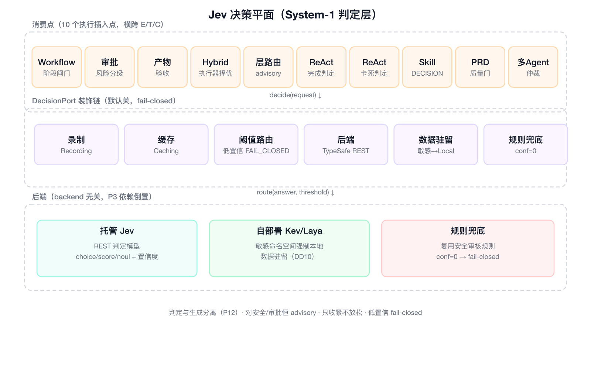

# 一个 Agent 框架的自我修养：Langur 的三条架构哲学

> 会自我进化的 Agent，为什么不该失控？这篇文章不打算给你念一份模块清单，只想把三件真正难的事讲透：怎么把一次 Agent 执行切成可独立替换的积木，怎么让"判断"与"生成"各走各的通道，又怎么给一个能改自己的系统套上安全的笼头。读到最后，你会拿到一套可以直接套到自己项目里的方法论——不是 Langur 独有的技巧，而是任何中台系统都通用的架构手感。


先看这张全局图。主链路是「接入层 → Harness 六组件 → 基础设施层」，右侧横着一条决策平面，左下是自我改进作为一条离线元循环，把反馈送回到 Harness。整篇文章都会绕着它展开。

## 先从一个扎眼的观察说起

市面上大多数 Agent 框架，最后都死在同三种写法上。不是功能少，而是**架构在第一次"变"的时候就塌了**。

第一种，**把 LLM 调用封装成一个函数**。`chat(messages, tools) -> 决策`，一个函数打天下。看起来清爽，可一旦你要"换一家模型、换一套记忆、换一个向量库"，就得顺着调用链一路改下去——因为所有依赖都焊死在那一个函数里了。

第二种，**把执行、工具、记忆、状态揉成一坨**。一个 `AgentRunner` 类里既跑 ReAct 循环、又管工具注册、还自己维护会话状态、顺手把日志也记了。每加一个能力，就多一层你不敢动的历史包袱。三个月后，没人知道哪一行能动、哪一行一动就崩。

第三种，**把"自我改进"做成黑盒**。让 Agent 直接改自己的提示词、改自己的路由，看似高级、实则失控——哪天它在生产上翻车了，你根本说不清是哪一次自我修改埋的雷，也回滚不到"修改之前"。

Langur 想反着来。它不追求功能多，只坚持三条架构哲学。每一条都不是口号，都在回答一个具体的"为什么这么切"。

## 哲学一：正交——架构的本质是切边界，边界的本质是端口

一次 Agent 执行，Langur 把它切成六个组件：


执行（E）、工具（T）、上下文（C）、状态（S）、生命周期（L）、可观测（V）。六块积木，各自独立，各管一摊。但它们不是空泛的"模块名"，每一块内部都长着企业级的肌理：

- **执行（E）**：四种范式——ReAct（边想边做）、PlanAndExecute（先规划再执行）、Workflow（固定流程编排）、Hybrid（分层调度）——共享同一套**终止闸门**（轮次 / Token 消耗 / 耗时 / 单轮工具数，四维硬约束）和**死循环检测**。**范式可以换，治理约束不换**：无论 Agent 用什么姿势跑，都不会跑飞、跑穷、跑到天荒地老。
- **工具（T）**：所有工具——MCP、REST、自定义 Skill、内置工具——走**同一条四层校验链**：权限 → 风险 → 白名单 → 限流。加工具不是"再注册一个"，而是"再走一遍同一条安全通道"。
- **上下文（C）**：四级记忆分层——瞬时（L1）/ 会话（L2）/ 任务快照（L3）/ 向量知识（L4），配语义召回和 Token 预算截断。**分层的意义不是分类癖，是成本可控**：能进 L1 的绝不进 L4，能用截断解决的绝不喂满上下文。
- **状态（S）**：快照式断点续跑 + 加锁防重入 + 幂等键。一个跑了二十分钟的多步任务，进程重启不会丢、不会从头重跑、不会重复扣模型费。
- **生命周期（L）**：BEFORE / AFTER 拦截点，把 Prompt 注入检测、输出审核、高危人审织进执行链路——安全不是事后补的，是流程自带的。
- **可观测（V）**：四维指标（调度 / 工具 / 模型 / 安全）+ SHA-256 审计链 + P0 阻断到 P3 日报的分级告警。每一次执行都留下不可篡改的痕迹。

这块值得停下来展开，因为它反直觉：**拆得越碎，反而越敢改**。

为什么？因为组件之间只靠端口通信。E 不关心 T 的工具有几层校验，T 不关心 C 的记忆存在哪里，C 不关心 S 的快照落在磁盘还是内存。组件内部的实现细节，被端口这道墙挡在外面。于是三件事自然成立：

- **换存储是改配置**：把内存向量库换成 Elasticsearch，只动基础设施层，E/T/C/S/L/V 六块积木一行不改；
- **依赖挂了能降级**：Redis 挂了，缓存和分布式锁静默降级到内存，主链路不断，只是丢了点性能——系统"慢"而不是"死"；
- **每个组件能离线测**：单测不依赖真实的大模型、Redis、向量库，一个组件的行为可以在本地几秒内确定性跑完，不用起一整个 Spring 容器。

这里的正交，不是"分文件"那种表面功夫，而是**语义上的可替换性**：任何一块积木，只要它对端口承诺的行为不变，内部实现随便换。这也是为什么四级记忆、四层工具校验链能各自演化、互不牵制——它们都挂在 C 和 T 内部，外面看不见、也动不了。

但这条哲学有一个最容易踩的坑，也是 Langur 反复强调的：**决策平面绝不能成为"第七个组件"**。

想象一下：如果决策平面也做成一个和 E/T/C 平级的"竖井组件"，那它就得被别的组件 import、被显式调用，六组件的正交就崩了，你不知不觉就回到了"揉成一坨"的老路——只不过这坨里多了一块更贵的积木。所以 Langur 的做法是：决策平面是一个**横切端口**，经依赖注入悄悄伸进 E/T/C 的各个消费点，谁需要谁就注进来，**注入不到就自动降级成原来的写法**，不给任何一块积木添硬依赖。正交性得以保住，决策能力又无处不在。

这套切法在工程上有个成熟的名字：**依赖倒置**。领域层定义端口（`LLMPort`、`VectorStore`、`DecisionPort`……），基础设施层去实现端口。判断它有没有做对，标准很简单粗暴——**换一个外部依赖，核心代码一行不改，就对了**。这是正交能真正成立的地基，后面所有哲学都踩在这块地上。

> **企业视角**：Harness 六要素合起来，其实在回答企业上线 Agent 最怕的三个问题——**它花了多少钱？（成本）它做对了没有？（质量）它出了事我能不能说清楚？（合规）** 四维终止闸门兜住成本，四层校验链和生命周期拦截兜住质量，审计链和分级告警兜住合规。而正交的真正价值在企业里会被放大：不同团队可以各自替换自己那块积木——你换你的向量库，我换我的工具链——**而不需要拉上整个框架一起改**。这才是一个"运行底座"该有的形状，而不是一个"跑一次 Agent 的循环"。

## 哲学二：能用廉价判断解决的，绝不烧昂贵的生成

大模型（System-2）擅长生成，但它有个被普遍低估的短板：**不擅长高频、廉价、可标定的判断**。

"该不该继续下一轮？这一步该不该跳过？这份产物能不能验收？这个操作要不要人工审批？"——这类问题，每次都要烧一次大模型推理来回答，就是在白烧钱：一次调用几十毫秒到几秒的延迟、真金白银的 token 成本，换来的却只是一个"是/否 + 一个概率"。而这类判断恰恰是 Agent 运行时最高频的操作。

Langur 的解法是引入一个**决策平面**，用 Jev 这类轻量判定模型去做 System-1：



一个 `DecisionPort` 端口：输入一个问题，返回 `choice / probability / score`，外加一个**置信度**——这个置信度是整个平面的灵魂，后面所有路由都靠它。端口外面包着一条装饰链，每一环都有明确的存在理由：

- **录制（Recording）**：把每次判定的请求和响应原样落进轨迹快照。成本几乎为零，但事后想补就极贵——它是"回放验证"（哲学三要用的）确定性的前提，也让每一次判断都沉淀为**可审计、可复用的资产**；
- **缓存（Caching）**：同样的状态 + 同样的问题，判定结果直接命中缓存，省掉一次判定往返；
- **阈值路由（ThresholdRouter）**：`confidence ≥ 阈值` 才采信并分流，`< 阈值` 一律不采信、回退到规则兜底；
- **规则兜底（RuleFallback）**：复用安全审核规则，其置信度恒为 0，意味着它**必然 fail-closed**——兜底永远是保守的那一边。

这套设计最值钱的，是它背后的那条总纲：**判定 / 生成分离**。判断走决策平面（快、廉、可校准、可批量、可回放），生成走 LLM，两条通道彻底解耦。它不是空谈，而是落进了 **10 个具体的执行插入点**：Workflow 的阶段闸门、审批的风险分级、产物验收、Hybrid 执行器的择优、ReAct 的完成判定、ReAct 的卡死判定、Skill 里的 DECISION 步骤、PRD 质量门、多 Agent 仲裁……每一个都是"原本要烧大模型、现在先走判定"的地方。**插入点越多，省下的钱越多——而且省的是线性增长的高频开销，不是一次性优化。**

这里藏着决策平面在企业里最硬的一层价值：**数据主权**。托管判定服务再便宜，也不能把敏感内容发出去。所以 Langur 按命名空间分流——命中 `legal-contracts`、`code` 这类敏感命名空间的判定，**强制走自部署后端**，绝不把合同、代码发给第三方云。**判定平面不是省钱的玩具，它是数据驻留的边界线。**

还有一条容易被忽略、却决定生死的红线：**决策平面对安全 / 审批闸门，永远只是"建议"，而且只收紧、不放松**。

具体讲：一个 CRITICAL 级别的审批，**永远要人来拍板**。决策平面最多给出一份"风险摘要 + 我的建议"，帮审批的人看更快、看得更准——但它**永远没有自动放行的权力**。低置信度一律回退到保守规则，绝不在"拿不准"的时候往"放行"那个方向偏。判断层的作用是**帮你提效、帮你收紧**，但它从头到尾都夺不走安全兜底的那把钥匙。这条红线是硬约束，不是"设计上倾向于"。

> **前瞻**：今天的决策平面，靠的是几个**人工标定的阈值**（比如路由 0.75、自动审批 0.90、产物验收 0.80、完成判定 0.85）——这是它的起点，不是终点。真正的终局，是这些阈值不再靠人拍脑袋，而是由数据自动调优，让判定器从"人工标定的仪器"进化为"自我校准的仪器"。而这一步自我校准，本身就要受哲学三那套护栏管辖——**连判断器改自己，也得走提案流程**。

一句话记住哲学二：**System-2 负责写，System-1 负责审；审的那道闸，人说了算。**

## 哲学三：能自我修改的系统，最大的敌人是自己

这是 Langur 最有想象力、也最危险的一块——**递归自我改进（RSI）**：回放、反思、蒸馏记忆、自合成技能、自我调优阈值、自扩展工具。


先问一个不舒服的问题：**一个能改自己提示词和路由的系统，怎么保证它不会越改越糟，甚至偷偷绕过安全策略？** 这不是杞人忧天——自我改进的反馈回路里，"让某次成功率 +0.3%"的候选和"让某个安全闸门失效"的候选，在数字上可能长得一模一样。

RSI 的每一层，都在替企业消化一种最贵的成本——**人的迭代速度**：

- **R0 回放验证**：把历史轨迹和录制的判定离线反事实重放，拿候选和基线对比。**本质是给 Agent 配了一套自动化回归测试**；
- **R1 反思自检**：输出前先做一次廉价初筛，低质才升级大模型改写。**是用便宜的方式拦住贵模型的低质输出**；
- **R2 记忆自蒸馏**：从成功 / 失败轨迹里提炼可复用的 L4 知识，低置信轨迹不污染记忆。**是让经验自动沉淀，而不是靠人手写沉淀**；
- **R3 技能自合成**：把高频成功的轨迹归纳成候选 Skill，校验通过后注册。**是让重复劳动自动变成标准工序**；
- **R4 策略自优化**：用 bandit 类方法调优判定阈值，劣化自动回滚。**是让调参这种"脏活累活"自动完成**；
- **R5 工具自扩展**：检测能力缺口、生成候选工具，配 SSRF / 内网护栏 + 强制人审。**是让能力边界随需求自己生长**；
- **R-G 安全平面**：统辖上面一切，是这套环路的刹车和方向盘。

用一个字概括这套设计的立场：**所有自我改进的产物，默认都只是"候选提案"，禁止直接生效，必须过三道关——回放验证、灰度、高危人审——才能上线，而且全程可一键回滚。**

第一道关是**回放验证**，也是安全前提。它把历史的执行轨迹、连同录制的判定结果（哲学二里那条 Recording 装饰链攒下的资产）离线重放一遍，拿候选和基线做反事实对比。引擎里写死了三个拒绝条件：**劣化即拒绝**（成本升高或丢失成功，直接毙掉）、**放松审批闸门即拒绝**（谁敢让闸门变松，谁就被拒，只收紧不放松）、以及最关键的——**回放通过，也不等于生效**。回放只是第一道体检，不是放行令。

第二道关是**安全平面统辖一切**。一个提案要走"提案 → 验证 → 应用"的三段式状态机，外面再套四道护栏：权限隔离红线（任何提案只要动到安全策略 / 校验层，提交即拒）、高危强制人审（调阈值、改路由、或触碰 critical 目标，必须有人显式批准）、递归深度上限（自我改进不能无限套娃）、变更频率限流（短时间窗口内的变更次数封顶），外加**一键回滚**——上错了，能退回上一步。

这套设计里藏着一个很妙的闭环，值得单独点出来：**Jev 帮 Agent 做判断，但 Jev 自己的阈值、路由要变，同样是一个受安全平面管辖的提案。** 换句话说，连"那个负责判断的判断器"自己，都不是法外之地。很多人做 RSI 会漏掉这一层——只给业务逻辑套笼子，却让判断器自由改自己的阈值，结果是最不可控的改动恰恰最自由。Langur 把这条也焊死了：**连判断器都不例外，这才叫真的统辖。**

> **企业视角**：企业真正需要的，从来不是"更聪明的黑盒"，而是**能过审的进化**。所以 Langur 做了一件很"反 AI 浪漫主义"的事——把人类研发的纪律，产品化给 Agent：回放就是回归测试，灰度和人审就是发布流程，回滚就是事故恢复，安全平面就是变更管控。一个理想的 RSI 闭环，应该像一个**不知疲倦、但严格遵守研发流程的工程师**：它提案、它自测、它等你批，而不是趁你不注意偷偷改完上线。**让系统自我进化不难，难的是让它的每一次进化都说得清、拦得住、退得回。**

一句话记住哲学三：**自我改进不是"让系统改自己"，而是"让系统的每一次自我修改，都走一遍和人类 PR 一样的评审流程"。**

## 地基：架构是"守"出来的，不是"画"出来的

三条哲学再漂亮，落不了地都是空中楼阁。Langur 踩在一块扎实的 DDD 六边形地基上：


```
start → api → application → domain ← infrastructure
```

六个 Maven 模块，方向严格单向。其中最核心、也最反"省事"本能的一条是：**领域层零外部依赖**。

领域层——六组件、决策平面的值对象、RSI 引擎这些最贵、最该复用的核心逻辑——**不 import Spring，不 import 任何基础设施 SDK，只依赖公共契约和 lombok**。代价很实在：领域层不能直接记日志、不能直接甩一个 `@Component`，一切都得靠端口和手动装配，写起来"啰嗦"。但收益同样实在：**两百多项领域测试全部是纯 JUnit5、零 Mockito、零网络，离线、确定性地跑完**——你永远不会遇到"测试在 CI 上偶发失败，因为连了个真实服务"这种折磨。

更关键的是最后这件事：这些"红线"不是写在文档里、靠大家自觉去守的空话，而是用 **ArchUnit** 写死的可执行断言——

- `domain` 不依赖 Spring / infrastructure；
- `api` 不直接调用 domain；
- `common` 里不能有状态 Bean；
- 分层依赖无环。

它们随 `mvn test` 一起跑，**一旦有人手滑把一条 import 引错了方向，CI 直接红灯、一票否决**。这就是 Langur 对"架构纪律"的态度：把口头约定变成代码里的检查，把检查变成 CI 里的拦路关卡。架构不是画在白板上的，是**守**出来的——而守的最好方式，是让违规这件事本身变得不可能悄悄发生。地基稳，上面三条哲学才有地方站。

## 拿走就能用的五条方法论

如果你也在做 Agent，或者任何类似的中台 / 框架系统，下面五条可以照着套。它们不依赖 Langur，是通用的架构手感：

1. **用端口切边界**：动手前先问自己——"哪几块可以独立替换、独立测试、独立降级？"想清楚了再拆。拆完用端口连，**别用 import 连**。import 一多，正交就死了。
2. **依赖倒置，且可验证**：让核心逻辑定义接口、让外部依赖实现接口。验收标准很粗暴——**换一个外部依赖，核心代码一行不改，才算做对**。改了一行，说明边界没切干净。
3. **判断与生成分层**：凡是"该不该 / 要不要 / 行不行"的高频判断，都值得一条廉价通道，别每次都烧大模型。给判断配上置信度和阈值路由，**低置信一律 fail-closed**。
4. **自改进套三关**：任何"系统改自己"的能力，产物默认当候选，必须过回放、灰度、人审，且能回滚。**记得把"判断器自己"也纳进管辖**——它是最容易被漏掉的一环。
5. **红线必须可执行**：把最重要的架构约束写成自动化断言（ArchUnit、lint、契约测试都行），让它在 CI 里拦人，而不是指望 code review 时的口头约定。约定靠记忆，断言靠机器。

---

## 号召开源共建

Langur 的这套设计已经全部落地，累计 600+ 项离线测试全绿。但一个 Agent 框架的进化，不该只是一个人的事。

如果你对下面任何一个方向感兴趣，欢迎一起共建：

- **决策平面**：接入更多判定模型后端，把 10 个插入点用到更多真实场景；
- **自我改进**：让"回放 + 灰度 + 人审"的闭环跑在真实业务上，验证这套安全范式到底扛不扛得住；
- **基础设施**：补齐更多模型厂商、更多向量库，让"换模型、换存储"始终停留在改配置这一步；
- **工程治理**：把上面那五条方法论，推广到更多项目里。

代码在 [github.com/Jashinck/Skylark](https://github.com/Jashinck/Skylark)（Langur 为其 Agent 框架子项目），设计文档随仓库开源，每一笔能力落地都有记录可追溯。

**如果你也在做 Agent，或者对"正交 + 判定分层 + 自改进护栏"这套范式有想法，欢迎提 issue、提 PR、一起讨论。** 让这只叶猴，再轻盈一点，也再聪明一点。
