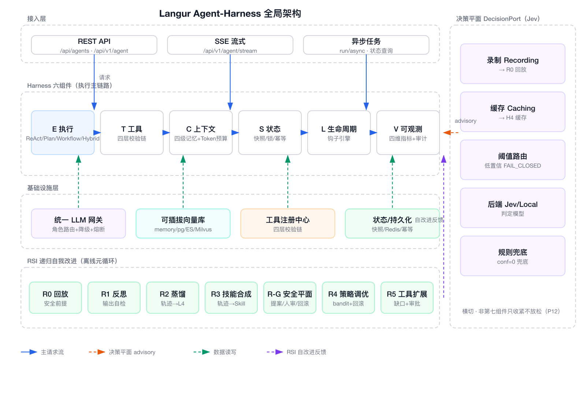
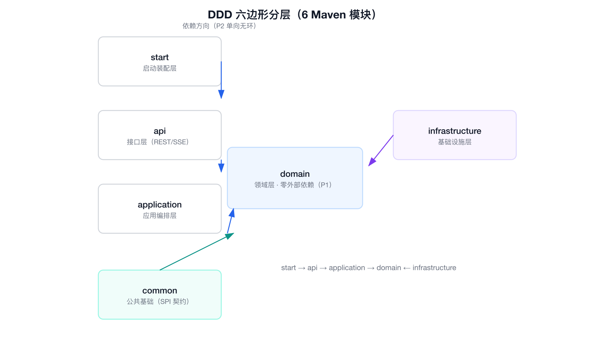
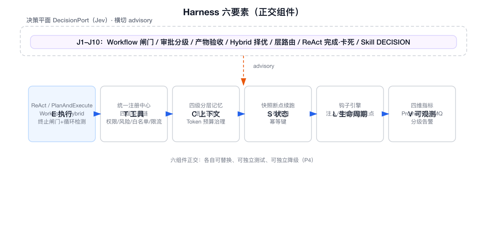
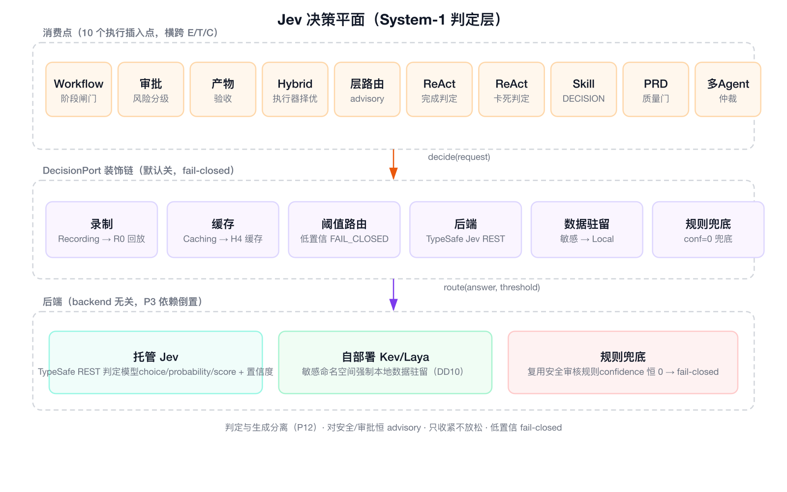

# Langur Agent-Harness：六组件正交、Jev 决策平面与 RSI 递归自我改进

> Langur（叶猴）是一个通用 Agent-Harness 框架。这篇文章不讲概念空话，直接展示它的四项核心能力——**DDD 六边形分层**、**Harness 六要素**、**Jev 决策平面**、**RSI 递归自我改进**——每一层都配一张架构图，讲清楚它解决了什么问题、怎么实现的。

先看全局架构，建立整体印象：



从上到下，从左到右：接入层把请求送进 **Harness 六组件**（E→T→C→S→L→V 执行主链路）；**决策平面**（右侧）横切在六组件之上，提供 System-1 快判断；**基础设施层**（模型网关 / 向量库 / 工具 / 持久化）在下托底；**RSI 递归自我改进**（左下）作为离线元循环，把自改进产物反馈回 Harness。

下面逐层拆解。

## 一、DDD 六边形分层：先立骨架，再谈能力

任何 Agent 框架的第一性问题是：**领域逻辑能不能扛住"换模型、换存储、换接口"而不崩？**

Langur 用 DDD 六边形架构回答——6 个 Maven 模块，依赖方向单向无环：



```
start → api → application → domain ← infrastructure
```

- **domain（领域层）**：Harness 六组件、决策平面值对象、RSI 引擎都在这里，**零外部依赖**（不 import Spring、不 import infrastructure）——这是所有能力的地基；
- **application（应用编排）**：用例编排，把领域服务串成业务流程；
- **api（接口）**：只暴露 REST/SSE，不直接碰领域模型；
- **infrastructure（基础设施）**：LLM 适配器、向量库、工具、持久化，全部实现领域端口；
- **start（装配）**：Spring 装配 + 配置。

关键不在"分了几层"，而在**依赖倒置**：领域定义端口，基础设施实现端口。换一家模型、换一个向量库，都是改配置而不是改领域代码。这条边界由 **ArchUnit 架构守卫**在 CI 里强制执行——domain 不 import Spring、api 不直调 domain、分层无环，不是口头约定，是可执行检查。

## 二、Harness 六要素：把 Agent 拆成六个正交组件

"一次 Agent 执行"被拆成六个组件，各自独立、可替换、可测试、可降级：



- **E 执行**：ReAct / PlanAndExecute / Workflow / Hybrid 四种范式，共用终止闸门 + 循环检测，任何一次执行都不会失控；
- **T 工具**：统一工具注册中心，所有工具——内置 HTTP、代码访问、知识库、Skill、MCP、REST OpenAPI——都走同一条**四层校验链**（权限 → 风险 → 白名单 → 限流）；
- **C 上下文**：四级分层记忆（L1 瞬时 / L2 会话 / L3 任务 / L4 向量知识）+ 语义召回 + Token 预算治理，上下文既够用又不超支；
- **S 状态**：快照断点续跑、分布式锁防重入、幂等键，长任务中断了能续上、重复请求不会重复执行；
- **L 生命周期**：钩子引擎，安全注入、输出审核、高危人审都挂在拦截点上，可以无侵入地插拔安全策略；
- **V 可观测**：四维指标（调度 / 工具 / 模型 / 安全 / 决策）+ 审计留痕，导出 Prometheus、MQ、分级告警。

正交的意义：**组件间靠端口通信，任何一个组件升级或故障，都不会牵一发动全身。**

## 三、Jev 决策平面：给 Agent 加一个"快判断"的系统一

大模型擅长生成，但不擅长高频、廉价、可标定的**判定**。Langur 引入决策平面，用 Jev 这类判定模型做 System-1：



- **一个 `DecisionPort` 端口**：输入问题，返回 `choice / probability / score` + **置信度**；
- **一条装饰链**：录制（→ R0 回放）⊃ 缓存（→ 省钱）⊃ 阈值路由（→ 低置信 fail-closed）⊃ 后端 ⊃ 规则兜底；
- **10 个执行插入点**：Workflow 阶段闸门、审批风险分级、产物验收、Hybrid 执行器择优、层路由 advisory、ReAct 完成/卡死判定、Skill 的 DECISION 步骤、PRD 质量门……

它解决的实际问题是：**"该不该继续、该不该跳过、该不该审批"这类判断，不该每次都烧一次大模型推理。** 用廉价的判定模型先过一遍，只有需要时才升级到 System-2。

安全红线（P12）：决策平面对安全/审批闸门**恒为 advisory，只收紧不放松，低置信即 fail-closed**。它帮 Agent 提效，但永远夺不走安全兜底。

## 四、RSI 递归自我改进：能自我进化，但先立安全前提

这是整套设计里最有想象力、也最危险的部分。Langur 的顺序是**先立安全底座，再谈自改进**：


- **R0 回放验证引擎（安全前提）**：把历史轨迹 + 录制的判定离线重放，任何候选策略先过"反事实对比"——劣化即拒绝、放松审批闸门即拒绝，且**回放通过 ≠ 生效**；
- **R1 反思自检**：输出前用决策平面廉价初筛，只有低质/低置信才升级到大模型自我批评改写；
- **R2 记忆自蒸馏**：把成功/失败轨迹提炼成 L4 知识，低置信轨迹不污染记忆；
- **R3 技能自合成**：从高频成功轨迹归纳候选 Skill，经回放校验 + 越权审查后注册；
- **R-G 安全平面（P0）**：提案-验证-应用三段式，权限隔离红线、高危强制人审、变更频率限流、一键回滚；
- **R4 策略自优化**：回放贪婪 bandit 调优 Jev 阈值，劣化自动回滚；
- **R5 工具自扩展**：能力缺口检测 + SSRF/内网护栏 + 强制人审 + 注册落库。

一句话概括 RSI 的哲学：**所有"自改进"产物默认都是候选提案，必须过回放、灰度、人审三道关才能生效。** 安全平面统辖一切，包括决策平面自身的阈值变更。

---

## 号召开源共建

Langur 的三条 RoadMap（2.0 / 2.1 / 3.0）已全部落地，累计 **600+ 项离线测试全绿**。但一个 Agent 框架的进化，不该只是一个人的事。

如果你对下面任何一个方向感兴趣，欢迎一起共建：

- **决策平面**：接入更多判定模型后端，把 10 个插入点用到更多场景；
- **RSI**：让自我改进闭环跑在真实业务上，验证"回放 + 灰度 + 人审"的安全范式；
- **基础设施**：补齐更多模型厂商、更多向量库，让"换模型、换存储"始终是改配置；
- **工程治理**：把 P1–P12 设计原则、ArchUnit 守卫推广到更多项目。

代码在 [github.com/Jashinck/Skylark](https://github.com/Jashinck/Skylark)（Langur 为其 Agent 框架子项目），设计文档随仓库 `design/` 目录开源，RoadMap 里每一笔能力落地都有完成记录、可追溯。

**如果你也在做 Agent，或者对"正交组件 + 决策平面 + RSI 自改进"这套范式有想法，欢迎提 issue、提 PR、一起讨论。** 让叶猴再轻盈一点，也再聪明一点。
